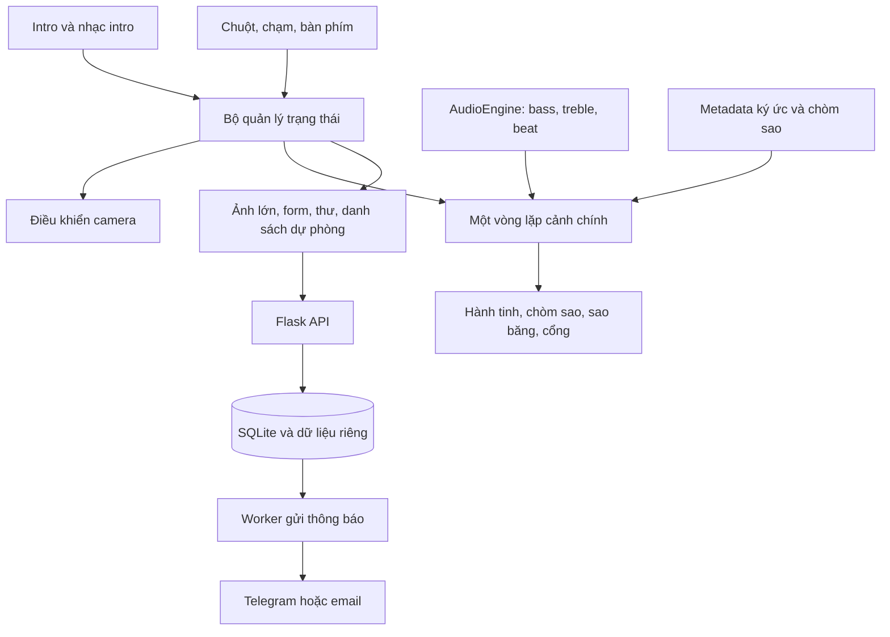

# Vũ trụ tình yêu 2.0 — Hành trình của hai đứa

Ngày lập: 21/09/2026. Trạng thái: bản 2.0 và M8 Heart Focus đã được tích hợp trong workspace; chưa phát hành. Phần hiện trạng bên dưới ghi lại baseline ở commit `59efeab`. Ước lượng bên dưới là dự kiến, không phải lịch giao hàng đã cam kết.

Cập nhật 22/09/2026: M8.4 đã triển khai theo video `heart.mp4`, qua kiểm thử Chrome và có ảnh/clip, số đo rAF/GPU. [Kết quả chi tiết](ENERGY_VORTEX_UPGRADE_PLAN.md#11-kết-quả-triển-khai-m84--22092026). Còn nghiệm thu điện thoại thật trước phát hành.

## 1. Định hướng sản phẩm

Biến trang kỷ niệm thành một nơi Pé Nhi có thể khám phá: ghé từng hành tinh để nhớ lại chuyện cũ, nối sao để nhận lời yêu, bắt sao băng để gửi mong muốn và mở một lá thư khi tương lai đến đúng hẹn. Âm nhạc kết nối toàn bộ trải nghiệm.

**Đề xuất giữ trái tim làm trung tâm của vũ trụ**, với các hành tinh ký ức quay quanh. Intro 28 giây hiện tại là chuyến bay đến nơi này. Sau intro, tên hai người và bộ đếm chuyển thành phần thông tin gọn ở mép trên, nhường vùng giữa cho khám phá.

Đối tượng chính là Pé Nhi; người chuẩn bị nội dung là Quang Anh. Thành công được đánh giá bằng sự dễ dùng, cảm xúc và khả năng truy cập lại ký ức. Không cần xây hệ thống phân tích hành vi cho một website riêng tư của hai người.

**Giả định:** ưu tiên trải nghiệm điện thoại, triển khai bằng Flask qua HTTPS, một người phát triển chính, nội dung được chuẩn bị song song. Thiết bị thực tế và nơi triển khai cần xác nhận trước khi chốt hiệu năng và lưu trữ.

Phạm vi phát hành 2.0 gồm đủ năm tính năng. Các mốc phát triển nhỏ bên dưới là cách tích hợp và kiểm thử dần; bản giới thiệu chính thức nên mang lại một hành trình liền mạch.

## 2. Hiện trạng đã kiểm tra

- `static/app.js`: cảnh chính dùng Three.js, trái tim 25.000 hạt, 4.000 sao và 1.500 hạt hào quang. Chỉ riêng cảnh chính đã có 30.500 hạt; chưa đo FPS trên thiết bị mục tiêu.
- Web Audio đã có `AudioContext`, `MediaElementAudioSourceNode`, `AnalyserNode`, FFT 256. Trái tim và hào quang thay đổi kích thước theo trung bình 10 bin đầu. Đây chưa phải bộ phát hiện nhịp trống; sao chưa phản ứng theo nhạc và chưa có nebula đổi màu theo treble.
- `static/intro3d.js` và `static/intro-audio.js`: intro điện ảnh, nhạc intro đồng bộ, sự kiện đóng intro và giải phóng GPU đã tồn tại. Nhạc nền trang chính được bật riêng.
- `image_catalog.py` và `static/memories.js`: tự tìm file ảnh, chưa có ngày chụp, chú thích hoặc nhóm cột mốc. Có 50 ảnh, tổng khoảng 42,29 MiB; ảnh lớn nhất khoảng 3,09 MiB.
- `static/love_song.mp3` khoảng 29 MB. Nhạc nền có `preload="none"`; cần giữ cách tải theo nhu cầu và tạo bản tối ưu, nghe so sánh trước khi thay thế.
- Sao băng hiện là phần tử CSS tạo mỗi 2,5 giây, sống 3 giây, đặt `pointer-events: none`; chưa có bắt sao hoặc gửi điều ước.
- HTML có bảng chính giữa, thư viện ảnh, lightbox và bốn thư “Open When...”. Các thư này có sẵn trong HTML; thư tương lai cần cơ chế khác để chưa đến ngày thì chưa tải nội dung xuống trình duyệt.
- `200.py` mới phục vụ trang và danh sách ảnh. Chưa có cơ sở dữ liệu, API điều ước, kiểm tra đáp án hoặc dịch vụ Telegram/email.
- Camera chính luôn chạy theo con trỏ trong vòng lặp render; `body onclick` luôn hiện bảng chính. Cần đổi hai cơ chế này trước khi bổ sung điều hướng hành tinh và vẽ sao.
- Có ba bộ kiểm thử trình duyệt: `browser_smoke.cjs`, `intro_cinematic.cjs`, `intro_audio.cjs`. Smoke test còn kiểm tra mở file trực tiếp và khi CDN bị chặn.

**Lưu ý về mốc thời gian:** code đang đặt ngày bắt đầu là **26/07/2025**, nhưng tiêu đề vẫn là “200 DAYS”. Nếu ngày này đúng, ngày kỷ niệm một năm là 26/07/2026, đã qua tại thời điểm lập kế hoạch. Đủ 1.000 ngày là 21/04/2028; nếu tính ngày bắt đầu là ngày số 1 thì ngày thứ 1.000 là 20/04/2028. Cần chọn một quy ước và dùng thống nhất theo `Asia/Ho_Chi_Minh`.

## 3. Hành trình và nguyên tắc tương tác

1. **Đến nơi:** xem hoặc bỏ qua intro; trái tim trung tâm hiện ra cùng các quỹ đạo. Lời dẫn ngắn: “Mỗi hành tinh là một nơi anh muốn cùng pé quay lại.”
2. **Khám phá:** chạm hành tinh có tên, camera đến gần, các ảnh liên quan xuất hiện. Luôn có “Về bầu trời”.
3. **Tự tay tạo kỷ niệm:** chọn “Nối những vì sao”, hoàn thành một hình, nhận thông điệp. Không bắt buộc hoàn thành để xem ảnh hoặc thư.
4. **Gặp bất ngờ:** sao băng có thể xuất hiện khi đang ngắm bầu trời. Bắt được thì có khoảnh khắc dừng một giây và ô viết điều ước.
5. **Hướng về tương lai:** một cổng tối ở rìa trời gợi tò mò. Chạm vào để thấy câu hỏi và mốc mở thư.
6. **Trở lại:** nhớ các chòm sao đã hoàn thành và tùy chọn âm thanh/hiệu ứng trên trình duyệt. Vẫn cần thao tác bật nhạc nếu trình duyệt yêu cầu.

Chỉ một tương tác chính được hoạt động tại một thời điểm. Khi đang nối sao, camera giữ yên và sao băng tạm ngừng xuất hiện. Khi đọc ảnh hoặc thư, các điều khiển nền không nhận chạm. Nhạc có thể tiếp tục; mức chuyển động và độ sáng nền giảm để dễ đọc.

Trên điện thoại, mọi chức năng đều dùng được bằng chạm; hover chỉ là gợi ý bổ sung trên máy tính. Hỗ trợ bàn phím, nút quay lại rõ ràng, vùng chạm tối thiểu 44 × 44 CSS px và chế độ giảm chuyển động.

## 4. Thiết kế chi tiết năm tính năng

### 4.1. Bản đồ Chòm sao Kỷ niệm

**Câu chuyện:** Pé Nhi tự nối những điểm sáng và tìm thấy một lời nhắn chỉ dành cho mình.

**Trải nghiệm đề xuất**

- Bản đầu có trái tim và bộ chữ QA & YN. Cung hoàng đạo là mẫu thứ ba khi biết đúng cung của Pé Nhi; chưa tự chọn thay.
- Một cụm sao sáng và một lời mời nhẹ giúp khám phá chế độ vẽ. Sau khi chọn mẫu, các sao nền dịu xuống và các điểm cần nối đứng yên.
- Máy tính: chọn điểm đầu rồi di chuột qua điểm hợp lệ để nối; click trống hoặc Escape kết thúc nét. Có thể giữ chuột và kéo nếu thích.
- Điện thoại: kéo qua các điểm hoặc chạm lần lượt từng điểm. Nhấc tay chỉ kết thúc nét, không xóa tiến độ; QA & YN có nhiều nét độc lập.
- Điểm gần được hút nhẹ vào đúng vị trí; đường xem trước và một điểm gợi ý giúp dễ hiểu. Có “Lùi một nét”, “Vẽ lại” và “Về bầu trời”.
- Hoàn thành thì hình sáng dần trong khoảng 1–2 giây, hiện lời nhắn; ví dụ trái tim: “Giữa bao nhiêu vì sao, anh vẫn luôn tìm thấy pé.” Đây là copy đề xuất, có thể thay bằng câu chuyện thật.

**Cách triển khai**

- Mỗi mẫu là tập điểm và cạnh hợp lệ; hoàn thành khi đủ cạnh bắt buộc. Chấp nhận đi hai chiều và nhiều nét, không yêu cầu vẽ QA & YN bằng một đường liên tục.
- Tách cụm sao tương tác khỏi 4.000 sao trang trí. Vị trí mẫu nằm trên một mặt phẳng hướng về camera; kiểm tra khoảng cách trong tọa độ màn hình để vùng chạm không thay đổi khó lường theo độ sâu.
- Dùng Pointer Events và pointer capture; xử lý `pointercancel`, đa chạm và đổi hướng màn hình. Chỉ tắt cuộn/chạm mặc định trong vùng vẽ đang hoạt động.
- Hoàn thành lưu bằng khóa có phiên bản trong `localStorage`; đây là tiến độ trang trí trên thiết bị, không dùng để bảo vệ nội dung. Nếu lưu trữ bị chặn, vẫn chơi được trong phiên hiện tại.

**Nghiệm thu**

- Trái tim và QA & YN hoàn thành được bằng kéo, chạm lần lượt và bàn phím; không tự nối qua khoảng trống giữa hai nét.
- Chạm sai không phá toàn bộ hình; điểm/cạnh đã nối không bị đếm lặp. Lời nhắn chỉ xuất hiện một lần cho mỗi lần hoàn thành.
- Không xảy ra bay camera, mở hành tinh hay hiện lại bảng chính trong lúc vẽ. Tiến độ vẫn đúng sau resize và khi mở lại trang.

### 4.2. Các Hành tinh Ký ức

**Câu chuyện:** mỗi hành tinh có tên, màu sắc và một câu chuyện, để những bức ảnh có vị trí trong vũ trụ của hai người.

**Nội dung và trải nghiệm đề xuất**

- Khởi đầu với 3–4 hành tinh, chỉ hiển thị nhóm đã có nội dung được chọn. Gợi ý: “Ngày mình tìm thấy nhau”, “Buổi hẹn đầu”, “Sau những giận hờn”, “Những ngày bình thường”. Đây là nhóm đề xuất, chưa phải những mốc đã xác nhận.
- Một hành tinh ấm màu đỏ hồng, một hành tinh pha lê, một hành tinh có vành đai tạo khả năng nhận diện. Dùng vật liệu đơn giản và texture nhỏ trước khi thêm shader phức tạp.
- Quỹ đạo chậm quanh trái tim. Khi hover, focus bàn phím hoặc chạm chọn, hiện tên và một câu ngắn; **quỹ đạo vẫn tiếp tục chạy** để bầu trời không bị đóng băng. Mesh, halo, nhãn và camera dùng cùng một trạng thái chuyển tiếp mềm.
- Click/chạm mở chuyến bay khoảng 1–1,5 giây. Sau khi đến, hiện 6–8 ảnh xem trước quanh hành tinh, tên cột mốc, ngày nếu có và chú thích. Những ảnh còn lại tải theo nhu cầu.
- Chạm một ảnh mở ảnh lớn với thao tác kế tiếp/quay lại. Trên màn hình hẹp, ảnh và lời kể có thể ở bảng phía dưới, còn hành tinh vẫn nằm trong khung cảnh.
- “Về bầu trời” đưa camera về vị trí cũ. Có danh sách hành tinh bằng nút văn bản để chọn nhanh và làm đường truy cập khi 3D không khả dụng.

**Cách triển khai**

- Tạo metadata ổn định cho ký ức; tên file không được dùng làm ngày chụp hoặc suy ra cột mốc.
- Tiếp tục tự phát hiện ảnh mới, nhưng ảnh chưa được gán chủ đề chỉ vào mục “Tất cả kỷ niệm”, không tự bịa chuyện hoặc tự gán sang hành tinh.
- Dùng `THREE.Raycaster` với vùng chọn rộng quanh hành tinh; nhãn DOM là các nút có tên truy cập được. Xử lý vật thể ngoài màn hình, bị che và nhãn chồng nhau.
- Một bộ điều khiển camera sở hữu mọi thay đổi vị trí. Trong chuyến bay, tạm khóa parallax và quỹ đạo mục tiêu; hủy hoặc hoàn tất chuyển cảnh một cách xác định khi người dùng quay lại nhanh.
- Tải thumbnail trước, ảnh gốc khi mở. Giới hạn texture đang giữ, giải phóng geometry/material/texture và listener khi rời cảnh.

**Nghiệm thu**

- Mỗi hành tinh mở đúng ảnh và chú thích; mọi ảnh cũ vẫn có đường truy cập qua kho tổng.
- Chọn liên tục, quay lại giữa chuyến bay, xoay điện thoại hoặc ảnh tải lỗi đều không làm kẹt camera.
- Sau 20 lượt vào/ra, số texture/geometry quay về mức ổn định sau khi cache nóng; không tăng tài nguyên theo mỗi lượt.
- Khi WebGL lỗi, vẫn chọn được chủ đề, xem ảnh lớn và trở về bằng giao diện thông thường.

**Cập nhật tương tác/phóng đại sau prototype:**

- Trái tim dùng scale nền khoảng `1.38` trên desktop và `1.18` trên mobile; không tăng số hạt, chỉ tăng kích thước hiển thị để giữ ngân sách GPU.
- Hành tinh dùng bán kính mesh khoảng `32` world units, halo khoảng `132`; hành tinh đang hover scale lên `1.28`, nâng nhẹ `10` units và tăng emissive/độ sáng quỹ đạo. Hành tinh đã chọn scale khoảng `1.2`.
- Hover/focus dùng spring damping theo `deltaTime` khoảng 300–500 ms; nhãn DOM cũng nâng và phóng đại nhẹ. Camera vẫn nhận parallax, còn chuyển động quỹ đạo không bị dừng.
- Raycast trên canvas nhận hover trực tiếp vào mesh; nhãn và bàn phím dùng cùng `hoveredPlanetId`. Touch không giả lập hover kéo dài: chạm chọn hành tinh vẫn đi thẳng vào chuyến bay.
- Khi một hành tinh được focus, trái tim/nebula giảm nhẹ opacity để tạo chiều sâu; khi rời focus các giá trị trả về mượt. Chế độ giảm chuyển động bỏ qua các chuyển động mạnh.

**Nghiệm thu bổ sung:**

- Hover liên tục ít nhất 10 giây vẫn thấy hành tinh và quỹ đạo chuyển động; không còn điều kiện `!hovered` chặn `elapsed`.
- Di chuột vào mesh hoặc nhãn đều cho cùng một scale/glow/lift; rời chuột trả về trạng thái nền mà không nhảy vị trí.
- Trái tim và halo lớn hơn rõ ràng nhưng không che nhãn; viewport 390×844 không tạo scroll ngang và vẫn chạm được hành tinh.
- 20 lượt focus/leave không làm tăng geometry/texture; profile hiệu năng giữ cùng ngân sách draw calls.

### 4.3. Hố đen Thời gian

**Câu chuyện:** một lá thư đã được chuẩn bị từ trước, chỉ mở khi vừa đúng người vừa đúng thời điểm.

**Trải nghiệm đề xuất**

- Cổng có quầng sáng nhỏ ở rìa màn hình, ngoài vùng nút điều khiển. Chạm trực tiếp để khám phá; thao tác bí mật có thể thêm sau như một cách tìm cổng bổ sung.
- Giao diện cho biết tên lá thư, ngày mở và câu hỏi riêng. Nhập sai nhận gợi ý nhẹ; nhập đúng nhưng chưa đến ngày thì thấy đếm ngược và lời nhắn chờ đợi.
- Khi đủ hai điều kiện, cổng mở và hiện thư. Những lần trở lại vẫn cần quyền mở hợp lệ; ghi nhận đã mở không đồng nghĩa công khai thư.
- Đề xuất bắt đầu với một lá thư. Mốc một năm đã qua nếu giữ ngày hiện tại trong code; có thể chọn kỷ niệm hai năm hoặc mốc 1.000 ngày.

**Cách triển khai**

- Ngày mở và nội dung được kiểm tra ở Flask. Frontend chỉ nhận metadata công khai; nội dung thư và đáp án không nằm trong HTML, JS, file static, source map hoặc repo công khai.
- Lưu hash đáp án bằng Werkzeug, chuẩn hóa Unicode NFC, khoảng trắng và chữ hoa/thường. Với câu hỏi ngày tháng, dùng giá trị ngày chuẩn; cách chấp nhận không dấu phải được chọn rõ ràng.
- Trạng thái gồm `sealed`, `waiting`, `open` và `temporarily_limited`. Quyền trả nội dung luôn được tính lại từ thời gian server và phiên đã trả lời đúng, kể cả gọi API trực tiếp.
- API trả `serverNow` và `unlockAt`; đồng hồ trên máy chỉ giúp hiển thị mượt. Đến 0 phải hỏi lại server, không tự hiển thị thư đã giấu sẵn.
- Dùng múi giờ rõ ràng, lưu timestamp UTC; hiển thị theo Việt Nam. Đáp án đúng có thể được nhớ trong phiên ngắn hạn; cookie không chứa đáp án hay thư.
- Giới hạn thử, khởi điểm 5 lần sai/15 phút theo phiên và IP, có thông báo khi thử lại được. Response riêng tư dùng `Cache-Control: no-store`.
- Câu hỏi kỷ niệm là cánh cửa lãng mạn với mức bảo vệ hạn chế. Nếu cần giữ cả website riêng tư, dùng thêm lớp truy cập chung; thư tương lai vẫn bắt buộc khóa ở server.

**Nghiệm thu**

- Đúng đáp án nhưng sớm một giây vẫn không nhận nội dung. Đúng tại/sau giờ mở thì nhận thư; đến ngày nhưng sai đáp án vẫn bị khóa.
- Đổi ngày trên điện thoại, sửa localStorage, tải lại trang hoặc gọi API trực tiếp không vượt qua khóa.
- Kiểm tra HTML, bundle và response trước giờ mở không thấy nội dung thư. Countdown đúng sau khi đưa tab vào nền rồi quay lại.
- Thiếu cấu hình thư hoặc server lỗi hiển thị thông báo thử lại; không vô tình mở khóa.

**Cần xác nhận:** ngày mở cụ thể, quy ước đếm ngày, câu hỏi, cách chuẩn hóa đáp án và nội dung thư. Dữ liệu riêng được cấu hình trên server khi triển khai.

### 4.4. Bắt Sao Băng Cầu Nguyện

**Câu chuyện:** một điều bất ngờ trên bầu trời trở thành một mong muốn thật mà Quang Anh có thể nhận được.

**Trải nghiệm đề xuất**

- Sao băng đầu tiên xuất hiện sau khoảng 10–15 giây ngắm trời; các lần sau cách nhau ngẫu nhiên 25–45 giây. Đây là thông số khởi điểm để thử trải nghiệm.
- Một lượt bay khoảng 2,5–4 giây, vùng bắt 44–56 px. Hướng bay luôn có đoạn trong vùng nhìn thấy và tránh vùng UI; chạm hụt có cơ hội sau, không bị phạt.
- Bắt đúng: dừng chuyển động cảnh khoảng một giây, giữ âm nhạc phát liên tục, rồi hiện câu đã đề xuất: “Pé đã bắt được sao băng! Hãy nhắm mắt ước một điều, anh sẽ biến nó thành hiện thực.”
- Form gồm nội dung điều ước, nút gửi và nút để sau. Giới hạn đề xuất 1.000 ký tự; giữ chữ đang gõ nếu mạng lỗi.
- Có lựa chọn “Ước một điều” trong chế độ giảm chuyển động hoặc sau nhiều lượt hụt, để thao tác nhanh không trở thành rào cản.
- Phân biệt “Điều ước đã được lưu, đang gửi đến anh” với “Điều ước đã gửi đến anh”. Không báo giao thành công chỉ vì frontend đã bấm gửi.

**Cách triển khai**

- Thay lịch CSS độc lập bằng đối tượng sao băng được cập nhật từ thời gian chung của cảnh. Vị trí ảnh và vùng click sử dụng cùng dữ liệu; không bắt trúng một vị trí đã bay qua.
- Chỉ sinh sao khi đang khám phá và tab đang hiển thị; tối đa một sao có thể bắt. Sau khi bắt, khóa đối tượng ngay để tránh mở hai form.
- Flask xác thực nội dung và lưu SQLite trước; sau đó worker gửi Telegram. Telegram là kênh đề xuất ban đầu vì luồng bot phù hợp, nhưng cần Quang Anh chọn kênh. Email có thể thay qua cùng một giao diện gửi.
- Bot token và chat ID/email đích ở biến môi trường server. Không cho client chọn người nhận. Escape nội dung hoặc gửi plain text.
- Mỗi lần gửi có khóa chống trùng do client tạo và tái sử dụng khi retry. Server trả lại cùng bản ghi cho cùng khóa; khóa trùng nhưng nội dung khác phải bị từ chối.
- Ghi điều ước và tác vụ gửi trong cùng giao dịch. Một worker riêng nhận tác vụ, timeout và retry có giãn cách; không tạo luồng nền tạm trong từng request Gunicorn.
- Khi dịch vụ nhận timeout sau khi có thể đã gửi thành công, vẫn có khả năng trùng thông báo phía Telegram/email. Dùng mã điều ước trong tin nhắn để nhận diện; không cam kết gửi đúng một lần tuyệt đối.
- Giới hạn tần suất, kiểm tra cùng nguồn/CSRF, không ghi nội dung điều ước hoặc token vào log. API tra cứu trạng thái chỉ trả điều ước thuộc phiên hiện tại.

**Nghiệm thu**

- Bắt được bằng chuột/chạm/bàn phím theo chế độ phù hợp; không mở hành tinh hoặc hiện bảng khác cùng cú bấm.
- Gửi lặp do double-click, reload và retry mạng chỉ tạo một bản ghi. Khởi động lại backend không làm mất điều ước đã lưu.
- Dịch vụ nhận bị lỗi thì trạng thái chờ/lỗi phản ánh đúng; worker gửi lại sau khi hồi phục. Nếu DB không ghi được, không báo đã lưu.
- Kiểm thử tự động dùng dịch vụ gửi giả lập; xác nhận tích hợp thật bằng một điều ước thử tới đúng người nhận khi cấu hình phát hành.

### 4.5. Vũ trụ Đồng bộ Nhịp đập

**Câu chuyện:** cùng một bản nhạc khiến sao, mây và trái tim phản ứng theo những cách khác nhau nhưng hòa hợp.

**Trải nghiệm đề xuất**

- Bass làm sao sáng lên mềm và tạo nhịp đập trái tim.
- Treble làm nebula chuyển sắc chậm trong bảng hồng–tím–xanh đã chọn; không đổi màu ngẫu nhiên mỗi khung hình.
- Năng lượng toàn bài làm trái tim nở rộng hơn ở cao trào. Thời điểm co/giãn bám nhịp phát hiện được, không suy diễn rằng bài càng to thì nhịp càng nhanh.
- Khi tắt nhạc, chuyển dần về nhịp thở nền. Khi đang đọc thư, giảm cường độ hình ảnh. Có tùy chọn hiệu ứng nhẹ độc lập với âm lượng.

**Cách triển khai**

- Tái sử dụng Web Audio, tách thành module riêng, chỉ tạo một media source cho mỗi audio element. Bảo toàn bật nhạc qua thao tác người dùng, resume context và luồng kết thúc nhạc intro hiện có.
- Thử FFT 2.048, đo trước khi chốt. Tính bin từ `sampleRate / fftSize`; bass khoảng 40–180 Hz, mid 180–2.000 Hz, treble 2.000–8.000 Hz, giới hạn theo Nyquist.
- Xuất tín hiệu chuẩn hóa `bass`, `mid`, `treble`, `energy`, `beatPulse`. Làm mượt attack/release và dùng ngưỡng thích ứng cùng khoảng nghỉ để tránh báo nhịp liên tục.
- FFT 256 hiện chỉ có độ phân giải khoảng 172 Hz tại 44,1 kHz; lấy 10 bin đầu trộn một phần dải trung. Đây là lý do cần đổi cách phân tích trước khi gắn thêm hiệu ứng.
- Điều chỉnh uniform, opacity và scale; tránh sửa màu hàng chục nghìn hạt trên CPU mỗi frame. Nebula ban đầu dùng ít sprite/shader plane, chưa cần mô phỏng thể tích nặng.
- Không có audio, audio lỗi hoặc phân tích bị CORS chặn thì dùng nhịp nền và giữ nút âm thanh hoạt động. Ở chế độ giảm chuyển động, tắt pulse mạnh và chuyển màu nhanh.

**Nghiệm thu**

- Tín hiệu tổng hợp dải thấp/cao kích hoạt đúng nhóm; bài hát thật được nghe và xem để chỉnh ngưỡng. Nhạc có beat phản ứng gần nhịp; đoạn không có beat không bị ép nháy đều.
- Play/pause liên tục không tạo source trùng hoặc lỗi context. Khi tắt nhạc, hiệu ứng dịu xuống trong khoảng một giây.
- Chuyển động theo thời gian thực, không nhanh gấp đôi trên màn hình 120 Hz; thay chất lượng không làm mất đồng bộ nhạc.

## 5. Kiến trúc đề xuất

Tiếp tục dùng Flask + JavaScript + Three.js. Tách trách nhiệm trong code hiện có trước; chưa cần thêm React, một engine game hoặc đổi toàn bộ pipeline build.

**Các phần dự kiến thay đổi/thêm**

- `static/app.js`: entry point và lớp tương thích cho UI đang có; chuyển dần các trách nhiệm ra ngoài.
- `static/universe/scene.js`, `camera.js`, `state.js`, `input.js`: renderer, vòng lặp, chuyển cảnh, điều phối thao tác.
- `static/universe/audio.js`, `planets.js`, `constellations.js`, `meteors.js`, `capsule.js`: từng tính năng với `init`, `update`, `dispose` theo nhu cầu.
- `static/universe/ui.js`, `api.js`: lớp giao diện truy cập được và xử lý request/trạng thái mạng.
- `static/universe.css`: tách CSS cho cảnh mới khỏi HTML lớn; kế thừa phong cách hiện có.
- `content/universe.json`: metadata công khai; build bản snapshot cho chế độ xem static. Không chứa thư tương lai, đáp án hay token.
- `200.py`: vẫn là entry point Flask; thêm `server/` cho routes, lưu trữ, kiểm tra capsule và gửi thông báo. `scripts/deliver_wishes.py` là worker triển khai riêng.
- `instance/`: DB/dữ liệu riêng trên volume bền vững, được loại khỏi git và static serving.
- `tests/`: mở rộng luồng trình duyệt và thêm kiểm thử backend cho thời gian, quyền đọc thư, lưu/retry điều ước.

**Trạng thái cảnh**

`INTRO → EXPLORE`; từ `EXPLORE` có thể đến `PLANET_TRANSITION → PLANET_VIEW`, `CONSTELLATION_DRAW`, `WISH_COMPOSE` hoặc `CAPSULE_VIEW`. Thoát mỗi chế độ quay lại `EXPLORE`. Lightbox là lớp con của xem ảnh; Escape đóng lớp trên cùng trước.

Chỉ bộ điều khiển camera được cập nhật camera. Vòng lặp chính truyền `deltaTime` và thời gian cảnh vào các module; tách thời gian chuyển động khỏi thời gian âm thanh. Khi bắt sao, chỉ dừng thời gian chuyển động một giây, không khóa JavaScript hoặc ngừng xử lý form.

Giữ nguyên ranh giới intro/cảnh chính, chỉ có một renderer hoạt động sau bàn giao. Tạm dùng cùng bản Three.js r128 đang có để giảm rủi ro; có thể phục vụ bản được ghim cùng website nhằm giảm phụ thuộc CDN. Việc nâng phiên bản lớn là một thay đổi riêng có kiểm thử.

**Tương thích:** để giữ đường xem `file://` đang được smoke test, ưu tiên các script `defer` đóng gói trong namespace nhỏ và dữ liệu snapshot, hoặc build ra bundle tương đương. Trang static vẫn xem được ảnh và hiệu ứng phù hợp; gửi điều ước và mở thư khóa thời gian yêu cầu Flask. Không mô phỏng thành công API bằng dữ liệu client.

## 6. Dữ liệu và hợp đồng API

**Metadata công khai**

- `UniverseConfig`: phiên bản schema, tên hai người, ngày bắt đầu có timezone, tiêu đề cột mốc, cờ tính năng và bảng màu.
- `Planet`: ID ổn định, tên, mô tả, phong cách, thông số quỹ đạo, thứ tự, danh sách memory ID.
- `Memory`: ID, file đã kiểm tra tồn tại, thumbnail, ngày tùy chọn, chú thích, alt text, chủ đề, thứ tự. Ảnh chưa phân nhóm vẫn thuộc catalog tổng.
- `Constellation`: ID, điểm chuẩn hóa, cạnh bắt buộc, các nét độc lập, thông điệp hoàn thành và phiên bản mẫu.

**Dữ liệu riêng**

- `Capsule`: ID, câu hỏi công khai, thời gian mở, hash đáp án, nội dung thư và phiên bản; phần riêng lưu server.
- `Wish`: ID, nội dung, thời gian tạo, khóa chống trùng, chủ sở hữu phiên và trạng thái giao.
- `DeliveryJob`: wish ID, số lần thử, lần thử tiếp theo, khóa nhận việc có hạn, lỗi đã lọc bí mật và mã phản hồi nhà cung cấp nếu có.
- Tiến độ chòm sao và cài đặt UI chỉ lưu local; chưa cần tài khoản và đồng bộ nhiều thiết bị.

**API dự kiến**

- `GET /api/universe`: cấu hình và metadata công khai, không có secret.
- `GET /api/capsules/<id>`: câu hỏi, ngày mở, giờ server và trạng thái cho phiên; không trả body thư trong response metadata.
- `POST /api/capsules/<id>/unlock`: kiểm tra đáp án, thời gian và rate limit; thiết lập quyền phiên ngắn hạn khi đúng đáp án.
- `GET /api/capsules/<id>/letter`: trả thư chỉ khi quyền phiên còn hiệu lực và giờ server đã đến; kiểm tra lại trên mỗi request.
- `POST /api/wishes`: xác thực và ghi điều ước cùng job trong giao dịch; trả `202` khi đã lưu/chờ gửi, không đồng nghĩa giao thành công.
- `GET /api/wishes/<id>`: trạng thái `queued`, `sending`, `sent`, `failed` của điều ước thuộc phiên. Client poll có giới hạn khi form đang mở.
- Mã lỗi thống nhất cho dữ liệu sai, chưa được mở, thử quá nhiều và dịch vụ chưa sẵn sàng; UI dịch thành lời nhắn ngắn, dễ hiểu.

SQLite phù hợp khi chạy trên một máy với volume bền vững và lượng truy cập nhỏ; áp dụng transaction, busy timeout và quy trình backup/restore. Nếu host dùng filesystem tạm hoặc chạy nhiều replica, chọn DB được quản lý trước khi xây cơ chế lưu. Rate limit và nhận job phải dùng lưu trữ chung, không dựa vào biến RAM riêng từng Gunicorn worker.

## 7. Hiệu năng và khả năng truy cập

Các con số sau là **mục tiêu cần đo**, chưa phải kết quả benchmark:

- Desktop mục tiêu gần 60 FPS; điện thoại mục tiêu ít nhất 30 FPS ổn định trong cảnh chính. Ghi p95 thời gian khung hình ở cùng một kịch bản 60 giây, sau khi tải xong tài nguyên cần thiết: ≤20 ms desktop, ≤40 ms điện thoại thử nghiệm.
- Nút và phản hồi chọn mục tiêu hiển thị trong khoảng 100 ms; chuyển cảnh được phép kéo dài theo thiết kế nhưng có thể thoát.
- Đề xuất profile mobile ban đầu: 8.000–12.000 hạt trái tim, 1.000–2.000 sao, 300–700 hạt hào quang; DPR 1–1,25. Giữ profile desktop gần hiện tại rồi đo tổng tải.
- Nếu FPS giảm liên tục khoảng 3–5 giây, giảm số hạt và độ phân giải; chỉ nâng lại sau thời gian ổn định để tránh dao động. Có chế độ nhẹ người dùng tự chọn.
- Thumbnail khoảng 640–960 px, mục tiêu thường 80–180 KB/ảnh; điều chỉnh theo chất lượng thực tế. Tránh tải toàn bộ 42 MiB ảnh khi vừa mở trang. Intro cũng dùng ảnh tối ưu và chỉ preload số ảnh sắp xuất hiện.
- Tạo bản nhạc phù hợp cho web từ nguồn hiện có, so sánh nghe trước khi chọn bitrate. Không cam kết kích thước cuối khi chưa kiểm tra thời lượng và codec.
- Một vòng render chính, raycast theo thao tác với danh sách mục tiêu nhỏ; dừng timer sinh sao và giảm/dừng render khi tab ẩn. Quay lại thì đồng bộ bằng thời gian thực.
- Chế độ giảm chuyển động được áp dụng cả JavaScript lẫn CSS: camera chuyển nhẹ, quỹ đạo đứng yên, nối sao vẫn dùng được, điều ước không bắt buộc đuổi theo sao.
- Modal có focus trap, trả focus khi đóng, Escape/Back đóng theo lớp, thông báo trạng thái dùng live region. Ô nhập vẫn thấy khi bàn phím điện thoại mở; dùng safe-area và đơn vị chiều cao phù hợp.
- Nếu mất WebGL hoặc thư viện 3D không tải được, kho ký ức, thư hiện có và các form vẫn có đường truy cập bằng DOM. Lỗi một tính năng không làm kẹt cả trang.

## 8. Lộ trình triển khai và ước lượng

Ước lượng cho một người phát triển đã quen stack, có ảnh và nội dung sẵn: **17–25 ngày công**, cộng khoảng 25% dự phòng thành **22–32 ngày công**. Nếu làm toàn thời gian, tương đương khoảng **5–7 tuần làm việc**; thời gian chờ nội dung, cấu hình dịch vụ hoặc lịch rảnh không nằm trong số này.

1. **M0 — Chốt nội dung và thử nghiệm kỹ thuật: 1–2 ngày.** Phác thảo desktop/mobile; phân nhóm 50 ảnh; xác nhận ngày và thiết bị; đo baseline; thử raycast, camera focus và phân tích bài nhạc. Đầu ra: cấu trúc nội dung, ngân sách hiệu ứng và các rủi ro đã kiểm chứng.
2. **M1 — Nền tảng cảnh và dữ liệu: 2–3 ngày.** Tách state/input/camera, chuyển động theo delta time, quản lý modal, metadata ảnh, thumbnail và fallback. Giữ các kiểm thử intro hiện có chạy được. Đây là điều kiện để ghép các tính năng an toàn.
3. **M2 — Âm thanh phản ứng: 2–3 ngày.** Tách dải tần, beat pulse, sao/nebula/trái tim, chế độ nhẹ và fallback. Đầu ra: cảnh hiện có đã sống động hơn trước khi thêm địa điểm khám phá.
4. **M3 — Hành tinh ký ức: 3–4 ngày.** Quỹ đạo, chọn mục tiêu, bay camera, ảnh theo chủ đề, quay lại và danh sách dự phòng. Đầu ra: đường xem ký ức mới hoàn chỉnh.
5. **M4 — Chòm sao: 2–3 ngày.** Trái tim, QA & YN, nối nhiều nét, chạm/chuột/bàn phím, lưu tiến độ và thông điệp. Mẫu cung hoàng đạo dùng cùng engine khi có dữ liệu; ước lượng giả định mẫu đơn giản.
6. **M5 — Thư tương lai: 2–3 ngày.** DB, cấu hình riêng, API khóa theo giờ server, rate limit, countdown, mở thư và kiểm thử ranh giới thời gian.
7. **M6 — Sao băng và điều ước: 3–4 ngày.** Lịch xuất hiện, bắt sao, dừng cảnh, form, lưu chống trùng, worker và một kênh gửi được chọn.
8. **M7 — Hoàn thiện và phát hành: 2–3 ngày.** Bao gồm tuning visual sau prototype: kiểm tra heart/planet scale, hover spring và quỹ đạo liên tục trên thiết bị thật. Kiểm tra tích hợp, thiết bị thật, mất mạng, WebGL lỗi, đo hiệu năng, chỉnh nội dung và chuẩn bị backup/rollback.
9. **M8 — Heart Focus cinematic: 1–2 ngày.** Click/chạm hit target ở trái tim mở chế độ `HEART_TRANSITION` → `HEART_FOCUS`; camera bay cận cảnh, trái tim tăng scale/glow/pulse, nền và hành tinh dịu xuống, panel DOM hiển thị tên `Quang Anh & Pé Nhi` cùng timer sống. Có đóng bằng Escape, click nền, nút “Về bầu trời”, hỗ trợ mobile, bàn phím, reduced-motion và WebGL fallback. Đầu ra hiện đã tích hợp trong `scene.js`, `app.js`, `universe.css` và HTML frontend; bước còn lại là tuning trên thiết bị thật.

**Quan hệ phụ thuộc:** M0 → M1; M2/M3/M4 cần nền M1; M5 cần quyết định host, dữ liệu riêng và ngày mở; M6 cần state của M1 và tầng lưu trữ/phiên từ M5. M8 cần nền tảng M1 và cảnh trái tim M2; thực hiện M8 trước nghiệm thu phát hành M7. M7 chỉ bắt đầu nghiệm thu đầy đủ khi năm tính năng và M8 đã tích hợp. Có thể chuẩn bị nội dung và dịch vụ nhận trong lúc phát triển phần hình ảnh.

Chia thay đổi theo các mốc thành những PR nhỏ, mỗi PR có thể chạy và kiểm thử. Dùng cờ `audioReactive`, `memoryPlanets`, `constellations`, `timeCapsule`, `shootingWishes`, `heartFocus`, `energyVortex` để tích hợp dần và tắt riêng phần lỗi. Đây là điều khiển phát hành, không phải cơ chế bảo mật.

### Chi tiết M8 — Heart Focus (đã tích hợp)

- Click/chạm trực tiếp trái tim hoặc nút “Chạm vào trái tim”; Enter/Space mở qua nút DOM. Trạng thái `HEART_TRANSITION` → `HEART_FOCUS`, dùng chung bộ điều khiển camera. Cờ `features.heartFocus` trong `content/universe.json` tắt riêng tính năng.
- Camera bay khoảng 1,25 giây, scale và glow nội suy theo delta time cả khi mở lẫn đóng. Kết hợp camera và scale cho độ phóng đại khoảng 2,2 lần trên desktop; mobile giới hạn theo chiều rộng để giữ nguyên hình trái tim.
- Trái tim ruby là đám mây điểm 3D mở, gồm 14.000 hạt bụi bề mặt/thể tích và 64 điểm lấp lánh; mobile/chế độ nhẹ còn 5.500 hạt và 24 điểm sáng. Cụm bụi ngoài 320 hạt được tái sử dụng giữa các lượt. Trái tim hướng mặt về người xem, đập theo nhạc và nhịp nhẹ; halo phản hồi con trỏ. Hành tinh/nebula dịu xuống nhưng bầu trời tiếp tục chuyển động.
- Tên lấy từ cấu hình `couple`, timer dùng chung phép tính với giao diện chính, cập nhật mỗi giây. Panel chữ DOM nằm dưới trái tim; màn hình ngang thấp chuyển sang bên phải.
- Nút quay lại, Escape hoặc chạm vùng ngoài panel (bao gồm trái tim đang phóng to) đóng cảnh. Chặn mở lặp, chặn tác vụ nền bằng inert và giữ focus tại nút đóng; trở về nút mở khi hoàn tất.
- Reduced-motion dùng camera chuyển ngắn, bỏ nhịp đập và quỹ đạo động. Khi thiếu/mất WebGL, dùng trái tim 2D cùng timer và toàn bộ thao tác đóng/mở; mất context giữa chuyển cảnh không làm kẹt trạng thái.
- Kiểm thử tự động: `tests/heart_focus.cjs` kiểm tra canvas click, touch, keyboard, timer, Tab/Escape, đóng ngoài, đóng giữa chuyến bay, resize, khôi phục hành tinh, mất WebGL và bộ nhớ GPU qua nhiều lượt. Ảnh kiểm tra lưu tại `output/playwright/heart-*.png`.
- Còn nghiệm thu thủ công GPU/audio/cảm ứng trên điện thoại thật trước phát hành. Kênh nhận điều ước vẫn cấu hình sau; cung Cự Giải đã được chọn cho Pé Nhi.

## 9. Kiểm thử và điều kiện phát hành

**Kiểm thử hồi quy**

- Mở rộng ba test hiện có: intro đủ thời lượng/bỏ qua, âm thanh bị chặn và bật lại, dọn canvas, kho ảnh, hộp thư, nhạc và fallback không CDN.
- Khi UI đổi, cập nhật assertion theo hành vi mới có chủ đích; vẫn giữ quyền truy cập toàn bộ ảnh. Kiểm tra riêng `file://` để các tính năng cần backend báo đúng khả năng của chế độ đó.

**Kiểm thử mới có giá trị**

- Unit cho đồ thị chòm sao nhiều nét, tách dải tần và xử lý ngày theo timezone.
- Backend integration cho đúng/sai đáp án, trước/đúng/sau mốc mở, gọi API trực tiếp, cache, giới hạn thử, dữ liệu điều ước sai và chống trùng.
- Worker integration cho lỗi nhà cung cấp, timeout, retry, restart giữa chừng và nhiều worker tranh cùng một job. Xác nhận không mất bản ghi đã nhận.
- Browser E2E cho chọn hành tinh → ảnh → quay về; vẽ → hoàn thành → tải lại; bắt sao → gửi → theo dõi trạng thái; nhập đáp án → chờ → mở thư.
- Browser E2E cho click/chạm trái tim → camera focus → timer hiển thị đúng → đóng bằng nút/Escape/click nền; lặp lại nhiều lần không tạo thêm geometry/texture và trạng thái hành tinh được khôi phục.
- Inject thời gian và lịch sao có kiểm soát trong test; không chờ đến ngày thật hoặc hy vọng sao xuất hiện ngẫu nhiên. Test production vẫn dùng đồng hồ server thật.
- Kiểm tra desktop Chrome, Safari macOS, Safari iOS thật và Chrome Android thật nếu có thiết bị. Viewport mobile trong Playwright chưa xác minh được đầy đủ audio/GPU/cảm ứng trên điện thoại.

**Điều kiện phát hành**

- Cả năm hành trình có thể dùng được từ đầu đến cuối; luôn thoát được về bầu trời; không có lỗi JavaScript làm ngừng trải nghiệm.
- Đúng nội dung đã chọn, không gán nhầm ảnh/cột mốc; thư tương lai thực sự không được trả trước hạn.
- Điều ước thử được lưu bền vững và nhận đúng kênh; UI phân biệt lưu thành công với gửi thành công.
- Đạt ngân sách hiệu năng trên thiết bị đã chốt; không rò tài nguyên sau kịch bản vào/ra nhiều lần.
- Chế độ nhẹ, giảm chuyển động, bàn phím và trường hợp không WebGL đều đã thử.
- Host có HTTPS, Flask không chạy debug ở production, dữ liệu riêng có backup và worker được giám sát/khởi động lại.
- Có bản phát hành trước để quay lại. Khi rollback giao diện, giữ DB điều ước và nội dung riêng; migration giai đoạn này ưu tiên bổ sung, không xóa dữ liệu đang dùng.

Các kiểm thử trên là công việc cần thực hiện khi triển khai. Lần lập kế hoạch này chỉ đọc mã nguồn và thống kê tài nguyên, chưa chạy benchmark hay xác nhận hành vi của tính năng mới.

## 10. Những quyết định cần chốt và giới hạn phạm vi

**Nội dung do Quang Anh cung cấp, trước mốc liên quan**

1. **Trước M0/M3:** ngày bắt đầu có đúng 26/07/2025, tiêu đề cột mốc, 3–4 nhóm ký ức, ảnh nào thuộc nhóm nào và câu kể ngắn. Nếu chưa phân nhóm xong, prototype dùng nhãn rõ là bản nháp, không phát hành nội dung suy đoán.
2. **Trước M4:** cung hoàng đạo, lời nhắn cho trái tim/QA & YN/cung. Engine chòm sao không phụ thuộc việc biết cung trước.
3. **Trước M5:** ngày mở thư, cách tính mốc 1.000 ngày, câu hỏi/đáp án và thư. Có thể phát triển bằng dữ liệu thử riêng, nhưng chưa bật capsule thật khi thiếu nội dung.
4. **Trước M6:** chọn Telegram hay email; người nhận và thông tin kết nối được cấu hình riêng trên server. Đề xuất Telegram cho bản đầu, chỉ xây một kênh trước.
5. **Trước M0/M5:** thiết bị Pé Nhi dùng, host hiện tại hoặc dự kiến, nơi lưu bền vững và có yêu cầu chặn truy cập toàn website hay không.

**Giới hạn bản 2.0 đề xuất**

- Một bộ nội dung được chuẩn bị trước, chưa làm trang quản trị ảnh/thư.
- Một kênh gửi điều ước, chưa gửi song song Telegram và email.
- Chưa có tài khoản, đồng bộ nhiều thiết bị hoặc tương tác trực tiếp giữa hai người cùng lúc.
- Cổng dùng hiệu ứng nhẹ để biểu đạt hố đen; mô phỏng thấu kính hấp dẫn, WebXR và bộ shader điện ảnh nặng để sau.
- Mẫu chòm sao có chủ đích, chưa nhận dạng hình vẽ tự do bằng AI.

**Tự đánh giá kế hoạch:** phần chắc nhất là các điểm tích hợp và xung đột tương tác, vì đã đối chiếu code. Phần còn ít bằng chứng nhất là thiết bị mục tiêu, chất lượng metadata và môi trường lưu trữ. Bước triển khai đầu tiên nên là M0: kiểm tra một hành tinh có thể chọn trên điện thoại, đo baseline cảnh hiện tại và xác nhận dữ liệu cá nhân; ba việc này quyết định độ mượt, ý nghĩa và tính khả thi của phần còn lại.

### M8.1 — Trái tim ruby phủ bụi sao (đã tích hợp)

- Module `static/universe/heart.js` quản lý lõi màu, lấy mẫu hạt theo diện tích mặt và shader lấp lánh. Cùng một group đảm bảo scale, xoay và nhịp nhạc đồng bộ.
- Bảng màu đỏ rượu/ruby/hồng rực; lõi dùng pha màu thông thường, hạt dùng cộng sáng. Phản sáng giới hạn và viền hồng tạo chiều sâu mà không phủ trắng màu nền.
- Bề mặt hai phía khép tại viền; nối pháp tuyến trùng vị trí, bỏ phân bố hạt hội tụ thành đường trắng giữa tim. Trái tim nghiêng nhẹ qua lại khi khám phá.
- Sparkle có pha/tốc độ riêng và tia bốn cánh; bụi có dải sáng chậm, phản hồi con trỏ khi focus. Chế độ giảm chuyển động giữ ánh sáng ổn định.
- Tài nguyên được tạo một lần, quản lý bằng resource owner của scene; không thêm tài nguyên mỗi lần mở/đóng. Hành tinh ẩn sau khi focus hoàn tất để không chồng lên trái tim.
- Kiểm chứng shader compilation bổ sung vào `tests/heart_focus.cjs`; cần xem ảnh desktop/mobile và đo trên điện thoại thật trước phát hành.

### M8.2 — Cosmic Energy Heart (đã triển khai)

- Hoàn toàn point cloud, không có lõi mesh. 70.000 hạt seeded xen kẽ ba lớp: 8.000 core, 50.000 mantle, 12.000 corona. Phân bố theo thể tích và bề mặt tham số; xoá dữ liệu pháp tuyến/material của lõi kín cũ.
- Vertex shader tính trường Simplex 3D, dòng xoáy quanh hai múi tim, dịch chuyển có giới hạn và vòng đời corona. Mức cao thêm chi tiết noise thứ hai; mức cân bằng/nhẹ dùng một trường noise. Không cập nhật position buffer từ CPU mỗi frame.
- Hồng/cyan theo cường độ trường và dải xoáy; vùng lõi chuyển trắng theo khoảng cách cục bộ. Hạt tròn mềm, additive, sparkle thưa; glow bằng hạt, không thêm bloom hậu kỳ.
- Một nhịp co–đập chính–đập phụ–nghỉ điều khiển scale và năng lượng; audio beat tăng nhẹ cường độ. Focus và con trỏ ảnh hưởng dòng chảy. Giảm chuyển động giữ trạng thái hạt ổn định.
- Desktop mặc định 70k, mobile 35k, light/reduced 16k; các lớp xen kẽ để draw range vẫn giữ toàn bộ cấu trúc. Khi khung hình >25 ms kéo dài, hạ về light ở cả EXPLORE và HEART_FOCUS; người dùng có thể chọn lại mức đầy đủ qua nút chất lượng.
- Xác minh shader/runtime, point-only, timer/focus, đóng nhanh, resize, mất WebGL và tái sử dụng GPU bằng tests/heart_focus.cjs. 60 FPS trên điện thoại thật là mục tiêu cần đo trên thiết bị, không phải cam kết từ viewport mô phỏng.

### M8.3 — Energy Vortex (lịch sử, đã được M8.4 thay thế)

- Thêm module độc lập `static/universe/vortex.js` với một `THREE.Points`, seed cố định và tối đa 15.000 hạt. Vòng đời GPU gồm hội tụ vào tâm, updraft xoắn vào tim và fade/respawn.
- Neo hình học theo `heart.bounds().minY`, truyền bán kính/chiều cao theo scale hiện tại của tim để không phụ thuộc tọa độ hard-code khi mở Heart Focus hoặc đổi viewport.
- Dùng chung `uTime`, `uBeat`, `uFocus` và pointer với Cosmic Energy Heart. Beat làm tốc độ xoay tăng tối đa khoảng hai lần và lõi cyan trắng sáng hơn.
- Fragment shader dùng additive soft particles, dải cyan đậm → trắng-cyan và sparkle thưa. Opacity giảm theo lifecycle và độ cao để không vượt qua nóc tim.
- Quality: 15k High, 8k Balanced, 4k Light/reduced-motion; không thêm texture hoặc cập nhật buffer hạt trên CPU. Resource được dọn cùng scene khi mất WebGL.
- Feature flag `energyVortex` đã thêm vào `content/universe.json` và snapshot `static/memories.js`. Pointer chuột/cảm ứng/bút chỉ bẻ cong luồng trong Heart Focus.
- Test mới: `tests/energy_vortex.cjs` kiểm tra point-only, neo theo focus, pointer force, quality và reduced motion.
- Còn lại: chạy browser test trên môi trường có Node/Playwright/Chrome, xem screenshot mỹ thuật và đo GPU trên thiết bị di động trước khi đưa vào điều kiện phát hành.

### M8.4 — Bệ năng lượng theo video tham chiếu (đã triển khai, kiểm chứng Chrome)

Chi tiết thiết kế, ảnh trước/sau và kết quả: [ENERGY_VORTEX_UPGRADE_PLAN.md](ENERGY_VORTEX_UPGRADE_PLAN.md).

- [x] **M8.4a — Bố cục:** bệ elip thấp, bán kính theo layout, gap dự phòng beat, nghiêng theo camera; điều chỉnh Heart Focus và vị trí nút mở để bệ không bị UI che. Đã xem ảnh desktop/mobile dọc/ngang Explore/Focus.
- [x] **M8.4b — Chuyển động:** đĩa orbit/lõi ổn định, feed ngắn taper/fade, clock tích phân; kiểm chứng cùng nhịp sau 5/60/600 giây mô phỏng ở 30/60/120 Hz.
- [x] **M8.4c — Ánh sáng:** cyan trắng, glow bằng hạt, 8/4 cung sáng hở trong một mesh ribbon; không dùng bloom toàn cảnh. Giữ 15k/8k/4k hạt; vortex có tối đa 2 draw calls, Light 1.
- [x] **M8.4d — Input:** ray-plane mapping, damping, primary touch/pen, drag không đóng focus, cancel/blur/leave; reduced motion pixel-identical và tiếp tục clock khi bật lại.
- [x] **M8.4e — Máy phát triển:** energy_vortex, heart_focus, universe_v2, universe_resilience đều PASS. Có ảnh/clip và benchmark; tài nguyên ổn định. Toàn cảnh 15 calls/14 geometry/1 texture, thêm đúng một call/geometry so với M8.3. rAF p95 16,7–16,8 ms; GPU p95 2,66 ms desktop, 0,67 ms viewport mobile trên Apple M1 Pro.
- [ ] **M8.4e — Thiết bị thật:** Safari iOS/Chrome Android, GPU/audio/gesture; chưa dùng số liệu giả lập để kết luận 60 FPS trên điện thoại.

Burst xuất hiện mạnh lúc vào focus là tùy chọn trong plan và chưa bật; trạng thái ổn định cuối video là bản mặc định. Chưa deploy. Mô tả M8.3 phía trên là lịch sử; M8.4 thay thế thiết kế vortex và hợp đồng point-only/1 draw call cũ.

- [x] **Tinh chỉnh ánh sáng M8.4:** tăng độ rõ của thân tim, hạ độ chói lõi bệ và flash theo beat; đã xem desktop/mobile/Light và chạy lại Heart Focus + Energy Vortex (PASS). [Ảnh đối chiếu](assets/heart-vortex-light-balance.jpg).
