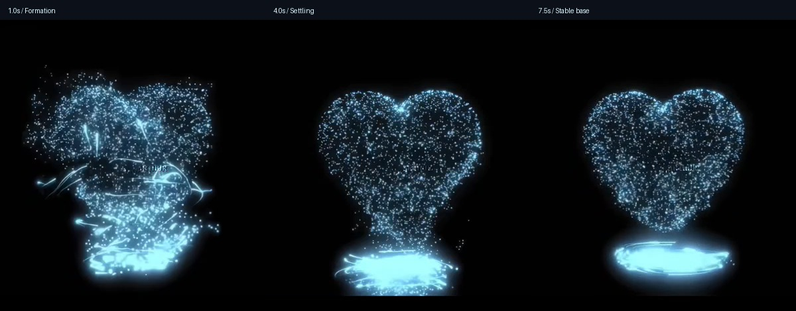
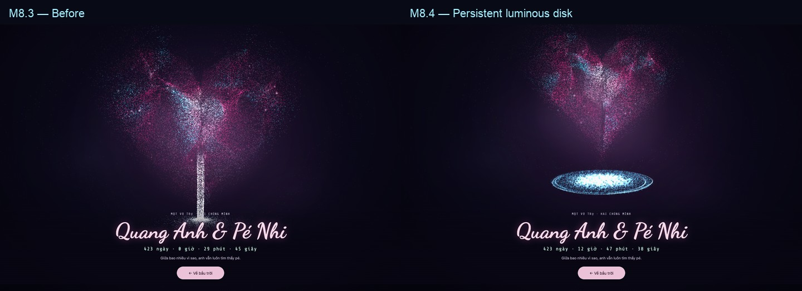
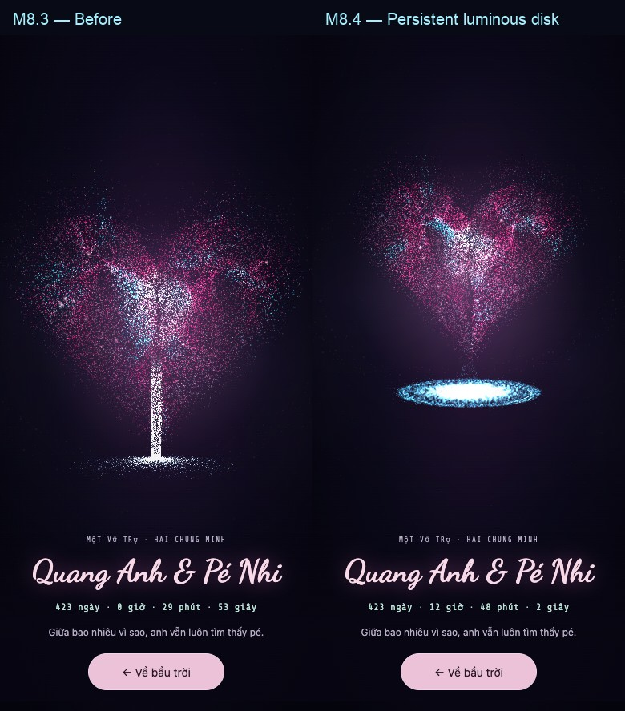
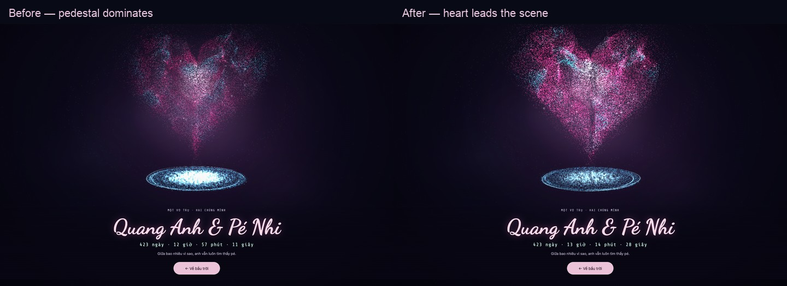

# Energy Vortex — nâng cấp theo video tham chiếu

Ngày: 22/09/2026. Mốc: **M8.4 — đã triển khai, kiểm chứng Chrome; chờ nghiệm thu thiết bị thật**.

Mục tiêu: bệ sáng thấp, có lõi cyan và những sợi sáng chuyển động quanh mép, nâng trái tim lên về thị giác. Trạng thái ổn định khoảng 6–8 giây của video là chuẩn chính; trạng thái hình thành ở đầu clip là tham khảo cho chuyển cảnh.

## 1. Tư liệu và phạm vi kết luận

- Nguồn do người dùng cung cấp: `/Users/maiquanganh/Documents/heart.mp4`.
- Container dài 8,1067 giây; track hình gồm 240 frame, 30 fps, khoảng 8 giây. Hình mã hóa 1280×720 có rotation −90°, hiển thị đúng hướng thành 720×1280.
- Đã xem 64 khung hình lấy mẫu 8 fps, các bảng ảnh giai đoạn hình thành/ổn định và chuỗi cách nhau 0,125 giây ở khoảng 4–5 giây. Kiểm tra thêm khung hình đúng mốc 1, 4 và 7,5 giây.
- Ảnh dưới được cắt vào vùng trái tim/bệ sáng, giữ tỷ lệ hình. Các mốc là thời gian của video, không phải timeline ứng dụng.



Quan sát được: dạng elip thấp, lõi sáng đầy, các cung sáng mảnh không đều, bụi nhỏ, phần nối với trái tim thu nhỏ dần. Không đủ bằng chứng để xác định chính xác chiều quay, vận tốc hạt, chiều di chuyển dọc trục hoặc thuật toán dựng/bloom của video. Những yếu tố đó sẽ được chọn và kiểm chứng trong bản triển khai. Chưa kết luận nhịp ánh sáng trong clip có bám nhạc hay không.

## 2. Những gì cần học từ video

| Khoảng thời gian | Quan sát | Áp dụng vào dự án |
|---|---|---|
| 0–1 giây | Mây hạt chưa thành tim rõ; các vệt sáng dài phân bố cả thân dưới | Chỉ dùng làm tham khảo cho hiệu ứng xuất hiện tùy chọn |
| 1–3 giây | Hình tim rõ dần, các sợi sáng còn quấn quanh phần dưới | Có thể tăng ngắn bụi nối và cung sáng khi chuyển vào Heart Focus |
| 3–6 giây | Tim đã rõ; bệ sáng cô đặc; còn phần nối hạt hẹp | Giữ chuyển tiếp mềm, không duy trì một cột dày xuyên thân tim |
| 6–8 giây | Chóp tim rõ hơn, khoảng hở nhỏ xuất hiện, bệ elip thấp có viền sợi | Chuẩn cho trạng thái thường trực trong Explore và Heart Focus |

Ba đặc tính quan trọng:

1. **Hình bao của bệ ổn định trong khi chi tiết chuyển động.** Các đầu cung sáng và cụm hạt đổi vị trí nhưng bệ không liên tục co hết vào tâm.
2. **Lõi đầy và viền có sợi.** Vòng nhìn như một đĩa năng lượng phát sáng; không phải chiếc vòng rỗng hay vài đường tròn đồng tâm hoàn hảo.
3. **Có phân cấp ánh sáng.** Bệ sáng tập trung, hạt nối thưa và nhỏ hơn. Khi áp dụng vào dự án, giữ trái tim hồng/cyan hiện có để tận dụng tương phản với bệ cyan.

Tỷ lệ đọc bằng mắt từ các frame cuối: bệ rộng khoảng 65–80% bề ngang lớn nhất của tim, tùy có tính các vệt ngoài cùng hay không; elip rộng khoảng 4–6 lần chiều cao phần viền. Đây là ước lượng ảnh 2D, không phải phép khôi phục kích thước 3D.

## 3. Vì sao bản M8.3 chưa đạt

Đối chiếu trực tiếp `static/universe/vortex.js`, `scene.js`, `camera.js`, `app.js` và `tests/energy_vortex.cjs`:

- **Mọi hạt cùng hội tụ và đi lên.** Bộ sinh tạo một đĩa đầy; shader giảm bán kính của toàn bộ hạt về lõi rồi đẩy lên. Thiếu lớp quỹ đạo giữ bệ tồn tại ổn định và thiếu nhóm cung sáng có hướng chạy rõ.
- **Nhịp đang làm thay đổi vị trí tức thời.** `life = fract(aPhase + t * speed * (1 + beat * .55))` và góc `spin = omega * t * (1 + beat)` nhân thời gian đã tích lũy với beat hiện tại. Khi beat đổi, cả lịch sử chuyển động bị đổi theo. Sai lệch lớn hơn khi phiên chạy lâu.
- **Thiếu nét liên tục.** Sprite tròn và sparkle bốn cánh tạo chấm sáng; chúng chưa tái hiện được các sợi cong mảnh có đầu và đuôi trong video.
- **Mặt phẳng dễ bị nhìn quá ngang.** Camera Explore gần ngang với trái tim; vòng nằm thấp trên X-Z. Tỷ lệ elip phụ thuộc camera và focus, chưa có mục tiêu bố cục để kiểm tra.
- **Hạt đi lên đang lớn thêm.** Công thức kích thước cộng `updraft * .25`; cần thu nhỏ hạt theo độ cao như kế hoạch ban đầu.
- **Tương tác sai hệ tọa độ.** NDC y của màn hình đang được dùng như z trên đĩa, bỏ qua camera, vị trí bệ và độ nghiêng. Pointer được sao chép ngay, chỉ strength giảm dần, nên chưa có damping vị trí.
- **Touch và chế độ tĩnh chưa kín.** Touch/pen vẫn có thể sửa camera pointer ngoài focus; lực pointer không bị chặn bởi reduced motion. Kéo trên backdrop còn có khả năng tạo click đóng Heart Focus lúc nhấc tay.
- **Kiểm thử chưa chứng minh hình ảnh.** Test mobile dùng `mouse.move`; `debug()` chủ yếu trả lại input. Chưa kiểm tra shader compile, đường chuyển động, hình elip, beat sau nhiều phút hoặc reduced motion bằng ảnh.

Chiều rộng hiện tại khoảng 68% bề ngang tim đã gần tỷ lệ tham chiếu. Không cần tăng kích thước hàng loạt. `depthTest` cũng không tự che được updraft bởi tim, vì tim không ghi depth; cần kiểm soát vị trí và alpha để tránh cộng sáng quá mức.

## 4. Thiết kế hình ảnh được chọn

Giữ module `U.createEnergyVortex(own)` độc lập. Bên trong tổ chức ba lớp thị giác:

| Lớp | Hình thái và chuyển động | Vai trò |
|---|---|---|
| Đĩa hạt và lõi sáng | Quỹ đạo vòng với bán kính ổn định theo từng dải; có hạt lấp đầy tâm; nhiễu nhỏ | Giữ bệ có thể nhận ra ở mọi frame |
| Các sợi sáng ở mép | 4–8 cung cong hở, khác chiều dài/độ cao/bán kính; đầu sáng, đuôi mềm | Làm hướng chuyển động đọc được |
| Bụi nối và tia thưa | Một phần nhỏ hạt rời đĩa, đi lên gần chóp, nhỏ và mờ dần | Tạo liên hệ năng lượng với tim |

Thông số khởi điểm để tuning, chưa coi là số đo của video:

| Thông số | Mục tiêu ban đầu |
|---|---|
| Đường kính bệ / bề ngang tim | 0,70–0,75; bắt đầu 0,72 |
| Chiều cao elip chiếu / chiều rộng elip | 0,20–0,28, đo viền và loại halo mờ |
| Khoảng hở nhìn thấy trên ảnh | Khoảng 4–8% chiều cao tim ở trạng thái ổn định; hiệu chỉnh theo phối cảnh |
| Dao động bán kính các dải | 2–5%, không cuộn hết về tâm |
| Cung sáng | 4–8 cung, khoảng 40–160° mỗi cung; lệch pha và độ cao nhẹ |
| Chu kỳ quay các dải | Khởi điểm 3–6 giây/vòng, lệch tốc độ khoảng 10–20% |
| Độ lệch do pointer | Giới hạn khoảng 5–8% bán kính bệ |

Chọn một chiều quay nhất quán cho phần chính; không khẳng định đó là chiều quay của video. Tâm dùng cyan trắng với glow mềm; độ trắng đủ để sáng nhưng vẫn phân biệt được sợi ở mép. Tránh glow lan thành mảng lớn che silhouette trái tim.

## 5. Hình học, anchor và chuyển động

**Anchor và camera.** Tiếp tục dùng `heart.bounds()` làm nguồn kích thước. Tách scale bố cục (`heartBaseScale × focusScale`) khỏi scale nhịp nhanh. Bán kính bệ đi theo scale bố cục để không thở mạnh ở mỗi beat. Tâm bệ theo cùng trục với tim; vị trí Y đi theo layout/focus, có khoảng hở dự phòng cho biên độ co bóp tối đa của chóp. Luồng bụi nối cập nhật đích theo chóp thực tế.

Chọn vị trí và độ nghiêng nhỏ của group bệ để đạt tỷ lệ elip mục tiêu ở Explore/Focus. Không đổi camera toàn cảnh chỉ để sửa vòng. Đánh giá cả phần viền gần người xem: chiều sâu và độ nghiêng có thể làm viền nhô lên, nên không dùng riêng công thức `minY - gap` để kết luận hình ảnh không chạm nhau. Nếu cần chỉnh nghiêng theo focus, nội suy nhẹ và không billboard theo con trỏ.

**Clock liên tục.** Scene tiếp tục là nguồn thời gian duy nhất; truyền thêm delta chuyển động đã áp pause/freeze/reduced motion. Trong module cập nhật các clock tích phân:

```text
spinPhase += motionDelta × baseAngularSpeed × (1 + beatBoost)
flowClock += motionDelta × flowSpeed
theta = seedAngle + bandPhase + spinPhase + boundedWave
life = fract(seedPhase + flowClock × particleRate)
```

Không nhân `time` tuyệt đối với beat. `uTime` dùng cho các dao động nền có biên độ nhỏ; `uBeat` điều chỉnh gain và vận tốc hiện tại. Cho phép burst lên gần 2× nhưng attack/release mềm; mức nghỉ và mức Light dịu hơn. Clock tạm dừng cùng cảnh, tiếp tục khi tab hiện, không cộng bù khoảng tab ẩn và không nhảy pha khi bật lại motion.

**Các lớp hạt.** Dải mép dùng bán kính ổn định, lệch pha và nhiễu thấp; lớp lõi vẫn phủ tâm bằng hạt mềm. Nhóm bay lên có lifecycle riêng, không lấy toàn bộ hạt nền đi lên. Fade đầu/cuối vòng đời đủ về 0 để respawn không lộ. Luồng đứng thường trực chỉ nối ngắn vào phần dưới trái tim; cả kích thước và opacity giảm theo độ cao. Không suy luận chiều flow từ video; chọn upward flow để giữ ý tưởng cung cấp năng lượng ban đầu.

**Trạng thái xuất hiện.** Ưu tiên làm trạng thái nghỉ đạt trước. Sau đó mới thêm burst tùy chọn khoảng 1–1,5 giây khi vào Heart Focus: tăng độ dài cung và số hạt nối nhìn thấy, rồi trở về bệ thấp. Thời lượng này là lựa chọn sản phẩm, không sao chép chuỗi hình thành 8 giây của video và không lặp ở từng nhịp.

## 6. Render, interface và ngân sách

Một `THREE.Points` chứa các lớp hạt xen kẽ bằng `aLayer`, để prefix của draw range luôn có đủ cấu trúc. Khởi điểm phân bổ khoảng 80% đĩa/lõi, 10% hạt nối và 10% tia nhỏ. Seed ổn định, buffer tạo một lần; CPU chỉ cập nhật uniforms/transforms.

Các cung sáng cần nét liên tục: gom các dải tam giác mảnh vào **một mesh ribbon** dùng chung material, biến dạng bằng vertex shader. Không dùng native `LineBasicMaterial.linewidth` để trông chờ bề dày nhất quán trên WebGL. Fragment shader làm mềm hai bên và fade theo chiều dọc sợi. Glow nền ban đầu vẫn lấy từ lớp hạt, chưa thêm render target hoặc bloom toàn màn hình.

Đây là điều chỉnh có chủ đích so với kế hoạch một draw call trước: High/Balanced tối đa **hai draw call bổ sung cho toàn bộ module vortex**, đổi lại có đúng sợi sáng của video. Trái tim vẫn giữ point cloud hiện có. Kiểm thử `pointOnly` của vortex cần thay bằng hợp đồng tài nguyên mới; kiểm tra point-only của heart vẫn có giá trị.

| Profile | Điểm hạt | Cung sáng | Ngân sách render của vortex |
|---|---:|---:|---:|
| High | 15.000 | 8 | Tối đa 2 draw calls |
| Balanced | 8.000 | 4 | Tối đa 2 draw calls |
| Light | 4.000 | Tắt mesh ribbon, giữ điểm ở viền | 1 draw call |
| Reduced motion | 4.000 | Tĩnh hoặc tắt | 1–2 draw calls, không chạy clock/beat/pointer deformation |

Interface giữ `group`, `quality(level, dpr)`, `update(frame)` và `debug()`. Bổ sung vào frame `motionDelta` và pointer đã đổi về tọa độ local; giữ các trạng thái layout, focus, opacity, beat hiện có. Scene làm mapping camera/input; module sở hữu sampling, quỹ đạo, shader và smoothing lực. `own()` tiếp tục quản lý disposal. Debug xuất clock, profile và tài nguyên thực tế phục vụ chẩn đoán, nhưng không thay cho bằng chứng render.

## 7. Chuột, cảm ứng và khả năng truy cập

- Lấy tọa độ từ bounding rect của canvas, tạo ray bằng camera hiện tại, giao với mặt phẳng bệ và đổi về local. Nếu ray gần song song hoặc điểm giao vượt vùng cho phép, giảm strength về 0.
- Dùng vị trí local để bẻ cong gần điểm đang chỉ trên bệ; không dùng NDC y như tọa độ z. Lực giới hạn ở một vùng nhỏ để đường bao vẫn rõ.
- Damping riêng vị trí đích và strength, khoảng 80–150 ms khi theo tay và 200–400 ms khi thả. Reset ở `pointerup`, `pointercancel`, `pointerleave`, blur và khi rời focus.
- Mouse được hover trong vùng cảnh; touch/pen lấy primary pointer trong Heart Focus. Không nhận pointer ở nút, text panel hoặc modal.
- Backdrop nằm trên canvas nên input cần xử lý đúng surface đó. Kéo quá ngưỡng khoảng 8 CSS px phải chặn click đóng phát sinh sau thao tác; tap nền vẫn đóng theo hành vi hiện có. Pointer capture và `touch-action` chỉ áp dụng vùng tương tác đang focus.
- Reduced motion giữ hình tĩnh, không chạy lifecycle hoặc biến dạng theo pointer; luồng đóng/mở và điều hướng bàn phím vẫn dùng được.

## 8. Trình tự triển khai và điều kiện qua mốc

| Mốc | Việc thực hiện | Điều kiện hoàn tất |
|---|---|---|
| M8.4a — Bố cục | Đĩa/lõi tĩnh, anchor, gap, độ nghiêng, viewport | Ảnh Explore/Focus desktop và mobile có bệ thấp đúng tỷ lệ, không bị panel che |
| M8.4b — Chuyển động | Clock tích phân, các lớp orbit/feed/spark | Chạy lâu không nhảy pha; bệ tồn tại ổn định khi beat thay đổi |
| M8.4c — Ánh sáng | Ribbon cung hở, core glow, taper/fade | Nhìn thấy sợi sáng và lõi đầy; không thành khối trắng phẳng hoặc cột sáng |
| M8.4d — Tương tác | Ray-plane mapping, damping, touch/pen, phân biệt drag/tap | Biến dạng đúng chỗ chỉ tay; kéo không đóng focus; reduced motion đứng yên |
| M8.4e — Nghiệm thu | Hồi quy, ảnh/video, profile GPU và tài nguyên | Bằng chứng hình ảnh/chuyển động đạt, test qua, ghi rõ giới hạn thiết bị |

Các file dự kiến: `static/universe/vortex.js` (sampling/shader/clocks), `scene.js` (layout/quality/coordinate mapping), `app.js` và `universe.css` (gesture trên focus backdrop), `tests/energy_vortex.cjs`, bổ sung hồi quy phù hợp vào `tests/heart_focus.cjs`. Chỉ sửa `heart.js` nếu cần mở rộng dữ liệu bounds; giữ feature flag `energyVortex` đang có, không cần backend mới.

## 9. Kiểm chứng cần có

**Hình ảnh và chuyển động:** ghi clip 8–12 giây Explore/Focus desktop, mobile dọc và ngang; dùng seed cố định và cùng góc nhìn để so trước/sau. Chọn trạng thái cuối video làm tham chiếu về hình thái, không đòi pixel-identical. Kiểm tra ellipse, độ rộng, gap, cung hở, core glow, hạt thu nhỏ và khoảng thở giữa tim/bệ. Trái tim hồng vẫn đọc được khi bệ sáng nhất.

**Clock và nhịp:** dùng cùng xung beat sau 5 giây, 60 giây và 10 phút; vận tốc giữ trong biên đã đặt, không đảo chiều hoặc tái sinh bất thường vì thời gian phiên. So 30/60/120 Hz với cùng timeline. Tab ẩn, freeze, đổi quality và reduced-motion không reset vị trí bất ngờ.

**Tương tác:** kiểm thử chuột và sự kiện cảm ứng thật qua browser automation, không dùng `mouse.move` làm bằng chứng touch. Đưa pointer tới điểm vành đã project rồi xem biến dạng quanh đúng điểm. Kiểm tra kéo, nhấc tay, cancel, nhiều ngón, thao tác nút, Escape và resize trong focus.

**Tĩnh và ổn định:** chụp ROI vortex cách nhau vài giây với reduced motion, kể cả pointer, để xác nhận không chuyển động. Bắt cả `pageerror`, `console.error` và lỗi compile/link GLSL. Thử feature flag off, WebGL mất, file preview; mở/đóng focus và đổi profile nhiều lần không tăng geometry/material/texture sau warm-up.

**Hiệu năng:** lấy baseline M8.3 cùng máy, viewport, DPR và âm thanh. Đo khoảng cách rAF p50/p95 và số draw calls/resources; đo GPU riêng nếu thiết bị hỗ trợ timer query. Mục tiêu ban đầu p95 <20 ms desktop, <25 ms mobile ở profile tương ứng cần xác minh, không coi viewport giả lập là điện thoại thật. Khi quá ngân sách, giảm ribbon/overdraw/point size trước khi tăng hạt.

Đã dùng Node/Playwright trong runtime bundle và Chrome để thực hiện các kiểm chứng ở mục 11.

## 10. Tiến độ và phạm vi

- [x] Đọc video đúng hướng; xem timeline và các frame cận cảnh.
- [x] Đối chiếu code, xác định lỗi clock, hình thái và input.
- [x] Chốt trạng thái thường trực, các lớp render và tiêu chí nghiệm thu.
- [x] Đưa M8.4 vào Plan tổng thể.
- [x] Triển khai M8.4a–d.
- [x] M8.4e: kiểm thử Chrome, ảnh/clip, rAF/GPU timer và tài nguyên trên máy phát triển.
- [ ] M8.4e: nghiệm thu Safari iOS/Chrome Android và GPU trên điện thoại thật.

M8.3 là bản đã tích hợp mã, chưa đạt nghiệm thu hình ảnh theo phản hồi người dùng. M8.4 thay thiết kế dòng chảy và render của vortex; không đánh dấu hoàn thành chỉ vì số hạt/uniform đúng hoặc backend tests qua.

## 11. Kết quả triển khai M8.4 — 22/09/2026

M8.4a–d đã hoàn tất; M8.4e đã kiểm chứng trên Chrome/macOS, còn nghiệm thu Safari iOS/Chrome Android và GPU trên điện thoại thật trước phát hành. Burst hình thành khi vào focus là tùy chọn, chưa bật: bản này ưu tiên bệ ổn định theo đoạn cuối video.

### Thay đổi đã tích hợp

- `vortex.js`: 80% hạt đĩa/lõi quỹ đạo bền vững, 10% feed ngắn thu nhỏ/mờ dần, 10% bụi mép; lõi cyan trắng và cung hở có đầu/đuôi mềm. Hai bộ geometry/material được tạo một lần. High/Balanced dùng một Points + một mesh ribbon (8/4 cung); Light/reduced chỉ vẽ Points. Không thêm texture, render target hoặc bloom toàn cảnh.
- `scene.js`: bán kính theo bố cục, khoảng hở dự phòng cho beat, độ nghiêng nhắm tỷ lệ elip 0,24; chỉnh scale/vị trí tim trong focus để bệ nằm phía trên chữ. Resize cập nhật profile. Pointer giao với mặt phẳng bệ thực rồi đổi về local; độ lệch tối đa 6% bán kính, vị trí và lực đều được làm mượt.
- Clock tích phân theo delta, smoothing beat với tích phân exponential; freeze/visibility/reduced-motion không cộng bù thời gian đã nghỉ. Reset đầu vào khi chuyển sang reduced motion hoặc tab đổi trạng thái hiển thị.
- `app.js`/CSS: pointer capture trên backdrop, phân biệt drag >8 px và tap, xử lý primary pointer/cancel/leave/blur. Nút mở Heart Focus được đưa xuống dưới bệ trong Explore; màn hình ngang thấp đưa nút sang phải và xếp thanh điều khiển sát đáy, giữ các shortcut để không che hiệu ứng.

### Bằng chứng kiểm thử

| Kiểm tra | Kết quả |
|---|---|
| `tests/energy_vortex.cjs` | PASS desktop và touch 390×844: shader/runtime, tỷ lệ elip 0,19–0,29, bố cục không che chữ/nút, số hạt/cung, giao ray tại vành đã project |
| Input | PASS Chrome CDP touch drag/end/cancel/đa chạm và pen drag; mouse hover, tap đóng, Escape/nút đóng, xoay ngang |
| Clock | PASS 5/60/600 giây mô phỏng qua module thật, cùng xung beat ở 30/60/120 Hz; tăng pha có giới hạn, không reset khi đổi profile/pause |
| Reduced motion | ROI vortex giữ nguyên pixel sau 1,6 giây và thao tác chuột; clock/force đứng yên; bật motion trở lại tiếp tục clock |
| Tài nguyên | Geometry/material IDs giữ nguyên qua đổi quality và nhiều lượt focus; geometry/texture không tăng sau warm-up |
| Feature flag/file | PASS tắt `energyVortex` và mở HTML qua `file://` |
| `tests/heart_focus.cjs` | PASS desktop, touch mobile, reduced và fallback; timer, keyboard, resize, context loss |
| `tests/universe_v2.cjs` | PASS desktop/mobile/reduced: hành tinh, chòm sao, capsule, retry điều ước và sao băng |
| `tests/universe_resilience.cjs` | PASS audio FFT/pause, 20 lượt tài nguyên GPU, WebGL loss và phục hồi UI |

Visibility gate được kiểm tra bằng override `document.hidden` có kiểm soát và sự kiện `visibilitychange`; không coi đây là nghiệm thu background tab trên Safari thật. Bài clock 10 phút là thời gian mô phỏng, không phải video render liên tục 10 phút. Các API gửi điều ước trong hồi quy dùng mock, không gửi thông báo thật.

### Hình ảnh và chuyển động





Baseline và bản nâng cấp dùng cùng viewport/DPR và không bật nhạc; bố cục Heart Focus thay đổi có chủ đích để lộ bệ nên góc/scale không hoàn toàn trùng. Ảnh chỉ so hình thái, không dùng làm phép đo pixel trước/sau.

Ảnh Explore/Focus desktop, mobile dọc/ngang và ảnh có nhạc: `output/playwright/vortex-*.png`. Clip chứa Explore → Focus: `vortex-{desktop,mobile,landscape}-preview.webm`; đoạn Focus 10 giây để xem lại: `vortex-{desktop,mobile,landscape}-focus.mp4`. Dữ liệu đo: `vortex-performance.json`, `vortex-baseline.json`, `vortex-clocks.json`. Các artifact đầy đủ ở `output/playwright/` (không vào git); hai ảnh so sánh phía trên nằm trong `docs/assets/` để lưu cùng tài liệu.

### Hiệu năng trên máy phát triển

Chrome headless, ANGLE Metal / Apple M1 Pro, DPR 1. Mỗi mẫu rAF gồm 300 khoảng khung hình; không ghi video cùng lúc đo. GPU timer query đo riêng 120 lần `renderer.render` có bật nhạc, bỏ kết quả khi GPU disjoint. Đây là toàn cảnh Heart Focus, không phải riêng module vortex.

| Viewport/profile | rAF p95 không nhạc | rAF p95 có nhạc | GPU p50 / p95 có nhạc |
|---|---:|---:|---:|
| Desktop 1440×960 / High | 16,7 ms | 16,8 ms | 2,42 / 2,66 ms |
| Touch 390×844 / Balanced (giả lập) | 16,8 ms | 16,8 ms | 0,51 / 0,67 ms |

Baseline M8.3 không nhạc: rAF p95 16,7 ms cho cả hai viewport, 14 draw calls / 13 geometry / 1 texture toàn cảnh. M8.4: 15 draw calls / 14 geometry / 1 texture, số điểm không tăng. Vortex riêng giữ 2 draw calls High/Balanced, 1 ở Light. Chưa có GPU timer baseline để kết luận phần trăm chênh lệch GPU. Các số đo này đạt mục tiêu ban đầu trên máy phát triển; không đại diện điện thoại thật.

## 12. Cân bằng ánh sáng tim và bệ — 22/09/2026

Theo phản hồi vòng xoáy lấn át trái tim, tăng sáng lớp thân/mantle và vùng giữa các sợi plasma, làm sắc hồng rõ hơn, tăng kích thước hạt mantle 8%. Lõi vòng xoáy giảm gain và độ phủ của hạt, giảm cường độ cung sáng và mức lóe theo beat. Giữ đĩa cyan đầy nhưng trái tim là điểm nhấn chính. Không đổi số hạt, draw calls hoặc quỹ đạo.

Đã xem ảnh Explore/Focus desktop, mobile 390×844 và Light; không có lỗi shader/runtime. Chạy lại `heart_focus.cjs` và `energy_vortex.cjs`: PASS, gồm reduced-motion pixel-identical và cảm ứng. Ảnh mới ở `output/playwright/light-balance-*.png`; benchmark và clip mục 11 ghi lại bản trước lần tinh chỉnh ánh sáng này, chưa đo lại GPU.


