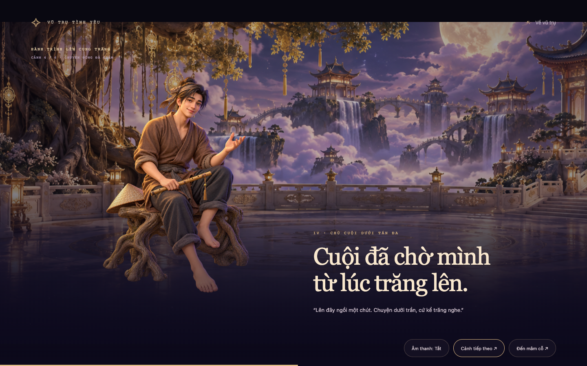
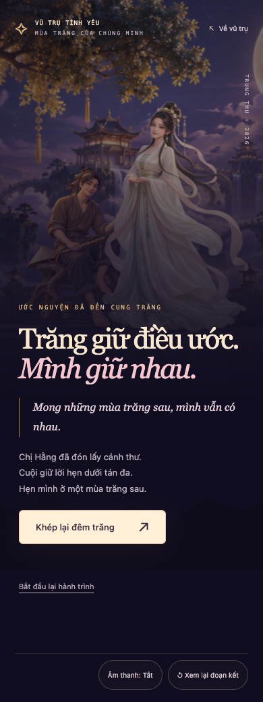

# Đêm trăng đoàn viên — hành trình lên cung trăng

Bản duyệt theo yêu cầu mới: **cinematic sau khi thắp đủ 5 cánh sao là phần chính**. Phá cỗ dẫn sang gửi ước nguyện; cinematic outro đưa cánh thư lên cung trăng, gặp Chị Hằng và Chú Cuội, rồi kết thúc concept.

[Mở bản chạy trên máy này](http://127.0.0.1:8765/docs/mid-autumn-cinematic-preview.html) · [File HTML](mid-autumn-cinematic-preview.html)

**Cập nhật v2.1:** đã sửa thư lệch tay, bổ sung lân tách khớp và tích hợp route Flask. [Kết quả kiểm tra và phần còn chờ nghiệm thu](MID_AUTUMN_V2_1_RELEASE_NOTES.md).

```sh
python3 -m http.server 8765 --bind 127.0.0.1
```

Chạy lệnh từ thư mục gốc dự án nếu server chưa mở. Bản HTML cần chạy qua HTTP vì sử dụng ES module. Preview dùng chung runtime với route Flask `/trung-thu/`; xem ghi chú phát hành ở trên.

## Hành trình

1. **Màn đón → Thắp đèn.** Năm cánh sao sáng theo từng lần chạm. Cánh thứ năm tự mở cinematic, không cần một nút xác nhận nữa.
2. **Cinematic chính, khoảng 33 giây.** Đèn mở lối → xuyên mây → cung trăng → Cuội dưới tán đa → múa lân → mâm cỗ.
3. **Phá cỗ.** Chọn bánh nướng hoặc bánh dẻo, rồi tiếp tục gửi một ước nguyện.
4. **Gửi ước nguyện lên cung trăng.** Viết tối đa 240 ký tự. Không nhận nội dung trống hoặc chỉ có khoảng trắng.
5. **Cinematic outro, khoảng 22 giây.** Cánh thư gấp lại, bay theo vệt sáng, đến đôi tay Chị Hằng cạnh Chú Cuội, rồi hóa thành điểm sáng.
6. **Kết thúc.** Hiển thị ước nguyện và lời hẹn mùa trăng sau. Có thể khép lại về trang chính, xem lại đoạn kết hoặc bắt đầu lại từ 0/5.

Ước nguyện chỉ ở trong bộ nhớ của trang và được thể hiện trong câu chuyện; không lưu, không gọi API, không gửi cho người khác. Đoạn kết là kết thúc của trải nghiệm, không phải xác nhận gửi email hay lưu trên server.

## Dàn cảnh chính

| Nhịp | Thời gian | Diễn tiến |
| --- | --- | --- |
| Chiếc đèn mở lối | 0–3,2 s | Đèn năm cánh sáng ở tiền cảnh; quầng sáng mở dần. |
| Qua miền mây bạc | 3,2–8 s | Đèn thu nhỏ theo chiều sâu, đi về phía trăng; cung điện hiện ra qua ánh sáng. |
| Cửa cung trăng | 8–13,5 s | Lộ sân điện, cây đa, thềm đá và mây nhiều lớp. |
| Cuội đón khách | 13,5–20 s | Camera tiến nhẹ về tán đa, Cuội đón người xem. Chữ tách sang bên để giữ rõ gương mặt. |
| Tiếng trống đêm hội | 20–29 s | Lân đỏ–vàng nhún, chào theo nhịp, bóng đổ co giãn theo động tác. Trống chỉ phát khi bật âm thanh. |
| Mời phá cỗ | 29–33 s | Nhịp dịu xuống, tự chuyển sang mâm cỗ. |




## Đoạn kết

| Nhịp | Thời gian | Diễn tiến |
| --- | --- | --- |
| Gấp một điều ước | 0–4 s | Nếp thư 3D khép lại, con dấu và ánh vàng hiện rõ. |
| Bay lên cung trăng | 4–10 s | Cánh thư theo đường cong, kéo một vệt bụi sáng qua lớp sao. |
| Hằng và Cuội đón thư | 10–16 s | Hai nhân vật hiện ra. Thư nhỏ dần đến gần đôi tay Hằng. |
| Giữ lại một ánh sáng | 16–22 s | Thư trở thành một điểm sáng; khung cảnh lùi nhẹ và chuyển sang kết thúc. |




## Hình ảnh và chuyển động

- Phông cung trăng và ba nhân vật được tạo bằng công cụ `image_gen`, lưu trong [thư mục artwork](assets/mid-autumn-story/). [Toàn bộ prompt](MID_AUTUMN_ART_PROMPTS.md) được giữ để tiếp tục chỉnh art direction.
- Nhân vật là **minh họa theo phong cách phim 3D, được dàn thành các lớp 2.5D** với chuyển động, tỉ lệ, ánh sáng và bóng riêng. Đây chưa phải mô hình nhân vật có bộ xương để diễn hoạt tay/chân độc lập. Lân v2.1 dùng atlas tách đầu/thân/chân, diễn hoạt từng khớp trong sân khấu 2.5D.
- Đèn ông sao, trăng ở đoạn chuyển cảnh, cánh thư và bụi sáng là hình học Three.js thời gian thực. Các lớp được điều phối bằng cùng một timeline để khớp camera, câu dẫn và hành động.
- Bối cảnh/nhân vật là cách kể cổ tích của concept theo yêu cầu chủ nhân, không dùng để khẳng định nguồn gốc hay nghi lễ lịch sử.
- Âm thanh trống và chuông được tổng hợp bằng Web Audio, bật mặc định; nếu trình duyệt chặn autoplay, lần chạm đầu tiên sẽ kích hoạt.

## Điều khiển và khả năng tiếp cận

- Có tạm dừng/tiếp tục, bỏ qua đúng đến bước kế tiếp, Escape và phát lại đoạn vừa xem.
- Reduced motion giữ đủ nội dung thành storyboard tĩnh có **Cảnh tiếp theo**; không bỏ mất Cuội, lân hay Hằng. Không chạy requestAnimationFrame trong chế độ này.
- Ẩn tab sẽ dừng timeline và âm thanh. Khi quay lại tiếp tục từ đúng vị trí.
- Mất WebGL vẫn xem được lớp minh họa/câu chuyện; cánh thư có bản CSS nhẹ.
- Các bước sau được mở theo tiến trình. Bắt đầu lại xóa ước nguyện và đưa đèn về 0/5.

## Phạm vi bản duyệt

Runtime hiện nằm trong `static/mid-autumn/`, template Flask riêng và route `/trung-thu/`. Trang chính đã có liên kết; liên kết quay về trỏ `/`. Không có gửi/lưu thật hoặc khóa ngày sự kiện.

Asset PNG gốc giữ trong tài liệu; runtime dùng WebP, bộ mobile khoảng 655 KB. Còn cần đo thiết bị thật và chốt art direction. Bản kiểm tra trình duyệt không thay cho kiểm chứng hiệu năng iPhone/Android thật.


## Kiểm tra bản duyệt ngày 25/09/2026

- Chrome chạy timeline thật: đủ 5/5 tự vào cinematic, tạm dừng/tiếp tục đúng, Cuội hiện rõ, lân thay đổi chuyển động, tự vào phá cỗ, outro có Hằng/Cuội rồi tự kết thúc. Kiểm tra này chưa xác nhận thư chạm đúng tay ở mọi kích thước màn hình.
- Kiểm tra lại lỗi lớp giao diện chặn nút xem lại ở màn kết: đã sửa; phát lại, Escape, âm thanh và reset đều thao tác được.
- Desktop 1440×900 và mobile 390×844: chụp đủ tất cả cảnh, không lỗi JavaScript. 320 px và màn ngang 812×375: không cuộn ngang, nút kết thúc/phát lại truy cập được.
- Reduced motion: ảnh chụp liên tiếp không đổi, không có animation frame; chuyển thiết lập trong phiên vẫn giữ đúng bước.
- Nội dung nhập có ký hiệu HTML hiển thị nguyên văn. Khoảng trắng không mở outro. Chặn Three.js vẫn đi hết hành trình bằng minh họa và thư CSS.
- Không gọi runtime hoặc API của trang chính. JavaScript qua kiểm tra cú pháp; `git diff --check` sạch.
