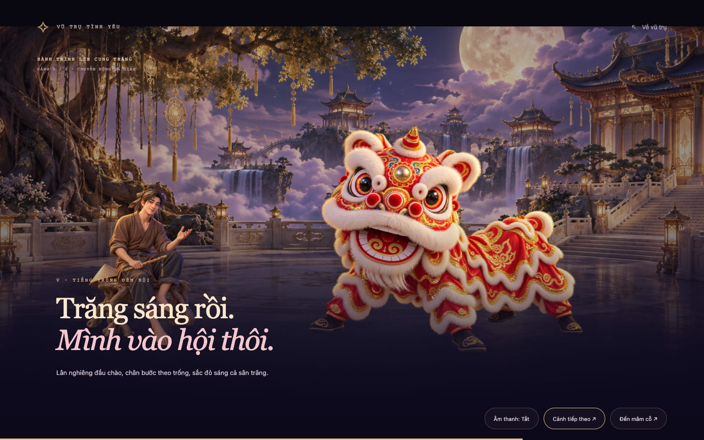
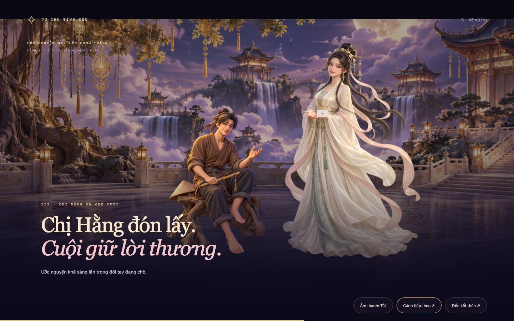

# Bản duyệt Trung Thu hiện tại

Đã có [bản tích hợp v2.1 và báo cáo kiểm tra](MID_AUTUMN_V2_1_RELEASE_NOTES.md).

**Concept:** thắp đèn mở đường lên cung trăng, vào đêm hội cùng Cuội và lân, phá cỗ, rồi gửi ước nguyện đến Hằng và Cuội để khép lại hành trình.

[Mở preview tương tác](mid-autumn-cinematic-preview.html) · [Timeline, hình ảnh và phạm vi](MID_AUTUMN_CINEMATIC_PREVIEW.md)

Cinematic chính tự bắt đầu sau cánh sao thứ năm và kéo dài khoảng 33 giây. Cinematic outro khoảng 22 giây chỉ bắt đầu khi người xem viết và gửi ước nguyện. Màn đón không còn tự chạy đoạn mở đầu dài để dành trọng tâm cho đêm hội sau khi thắp đèn.

## Cần xem khi duyệt

- Cảm giác chuyển từ chiếc đèn lên sân cung trăng; độ dài từng nhịp và thời gian dành cho Cuội/múa lân.
- Cách đọc hình trên mobile, độ rõ gương mặt và khoảng trống dành cho chữ.
- Nhịp bay và điểm đến của cánh thư; cảm giác khép lại sau khi ước nguyện được đón nhận.
- Art direction hiện dùng minh họa nhân vật phong cách phim 3D, diễn hoạt nhiều lớp 2.5D; đèn/thư và hạt sáng dựng bằng Three.js. Xem ghi chú kỹ thuật trong tài liệu timeline để phân biệt với nhân vật 3D có rig hoàn chỉnh.

## Các vòng cũ

SVG vòng đầu và ảnh `mid-autumn-cinematic-*` được giữ để đối chiếu. Luồng “Lời chúc” và cinematic mở đầu ở những bản cũ đã được thay bằng hành trình hiện tại.

Trang Trung Thu vẫn là trang phụ trong **cùng website, cùng Flask app**. Hiện chỉ có bản duyệt riêng dưới `docs/`; trang chính giữ nguyên.
