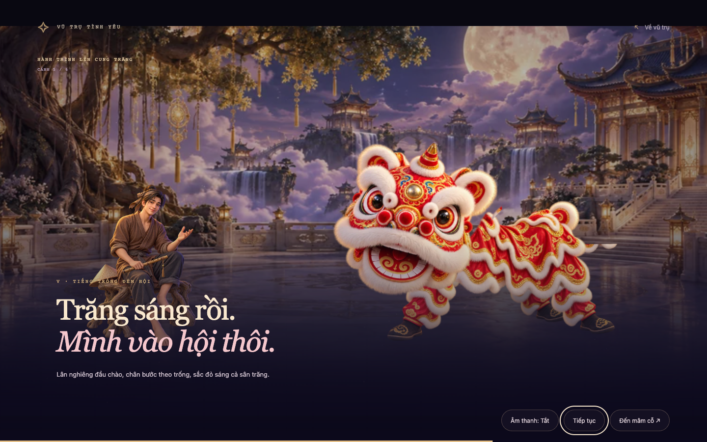
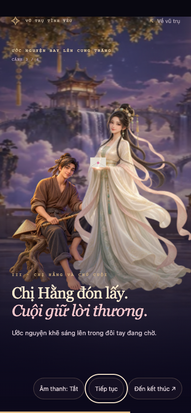

# Trung Thu v2.1 — Bản tích hợp để nghiệm thu

Ngày cập nhật: 25/09/2026. Đã triển khai trong mã nguồn và kiểm tra cục bộ; chưa phát hành lên môi trường công khai. Kiểm tra Safari/iPhone và Android thật còn chờ thực hiện.

## Trải nghiệm

Thắp đủ năm cánh sao tự mở cinematic chính 33 giây: đèn dẫn qua mây, cung trăng, Chú Cuội và múa lân. Sau phá cỗ, người xem viết ước nguyện và xem outro 22 giây với Hằng/Cuội đón thư, thư hóa ánh sáng rồi kết thúc.

Trang chính có liên kết **Đêm trăng đoàn viên**. Trang phụ `/trung-thu/` chạy trong cùng Flask app; không tải runtime Universe. Trang chính không tải artwork hay renderer Trung Thu. Ước nguyện không lưu, không gửi API/email; reload hoặc bắt đầu lại sẽ xóa nội dung trong phiên.

Mở bản đang chạy: [Trung Thu v2.1 trên máy này](http://127.0.0.1:5002/trung-thu/). Nếu server chưa mở, chạy từ thư mục dự án:

```sh
.venv/bin/python -m flask --app app run --host 127.0.0.1 --port 5002
```

## Sửa lỗi thư lệch tay

Bản cũ đặt tay Hằng bằng CSS responsive, nhưng thư Three.js dùng hai điểm cuối cố định. Ca tái hiện tại giây 14,5 đo lệch 24,33 px ở 1440×900, 25,39 px ở 390×844 và 34,25 px ở 812×375.

Bản mới gắn neo vào vị trí `(260,520)` trên artwork Hằng gốc 1024×1536. Neo nằm trong cùng lớp transform với nhân vật. Đường bay, thư CSS, điểm nhận thư và ánh sáng dùng chung tọa độ; điểm tiếp xúc là giữa mép dưới phong thư. Thư giảm tốc, nằm trong tay ở giây 14–16 rồi tan ở giây 16–18. Resize trong lúc bay giữ vị trí hiện tại trước khi chuyển tiếp đường bay; khi đã nhận thư tiếp tục bám tay.

Đồng hồ nhân vật lấy từ tiến độ cinematic nên pause/replay không thay đổi pha nhận thư. Kích thước thư giảm theo nhân vật ở màn ngang. Đã xem ảnh đối chiếu để xác nhận neo thực sự nằm trên tay, không chỉ kiểm tra hai giá trị cùng nguồn.

## Hình ảnh, điều khiển và tải tài nguyên

- Lân dùng atlas mới với đầu, thân và chân riêng, ghép bằng SVG và diễn hoạt từng khớp: chào, bước theo trống, ngẩng đầu rồi nghỉ. Hằng/Cuội vẫn là artwork 2.5D với chuyển động nhẹ; chưa phải mô hình 3D có xương và diễn hoạt ngón tay.
- Giữ sân cung trăng, mây nhiều lớp, đèn/thư 3D và âm thanh tổng hợp bật mặc định, tự phát khi được trình duyệt cho phép và mở khóa ở lần chạm đầu nếu bị chặn.
- Có pause, skip/Escape, replay, reset; nội dung ước nguyện đếm tối đa 240 ký tự hiển thị bằng `Intl.Segmenter` trên trình duyệt hỗ trợ. Nội dung có HTML được hiển thị như văn bản.
- Reduced motion chuyển từng cảnh thủ công, có cảnh thư đã nằm trong tay và không chạy vòng animation liên tục. Mất WebGL chuyển sang thư CSS.
- Tải ảnh thất bại hoặc quá 8 giây có thử lại/tiếp tục cảnh nhẹ. Nếu thiếu Hằng, thư không bay tới bàn tay vô hình. Nội dung câu chuyện vẫn đi tới kết thúc.
- Artwork WebP của bộ mobile tổng **655.190 byte** (~655 KB); bộ desktop lưu trong repo khoảng 1,16 MB. Mức tải thực tế tùy `srcset`, viewport và DPR; đây là tổng dung lượng file, không phải số đo tốc độ mạng. Atlas lân mobile được dùng chung để tránh tải trùng. Ảnh PNG gốc chỉ giữ trong tài liệu.
- Renderer/timeline/âm thanh có vòng đời riêng; ẩn trang dừng tiến độ và audio, đóng trang giải phóng tài nguyên. Tránh tạo thêm vòng render khi phim tự chuyển bước.
- Bộ phát nhạc hủy lịch fade cũ trước khi tạo fade mới, nên seek/replay liên tiếp không tạo lỗi Web Audio trên Chromium; module âm thanh đã tăng cache-busting lên `music-cues-4`/`volume-8`.

## Kiểm tra

Chạy với Node và Playwright theo README, server ở cổng 5002:

```sh
LOVE_TEST_URL=http://127.0.0.1:5002/ node tests/mid_autumn_alignment.cjs
LOVE_TEST_URL=http://127.0.0.1:5002/ node tests/mid_autumn_flow.cjs
LOVE_TEST_URL=http://127.0.0.1:5002/ node tests/mid_autumn_lifecycle.cjs
.venv/bin/python -m unittest discover -s tests -p 'test_*.py' -v
```

- **Alignment:** 132 mẫu, 11 kích thước màn hình, WebGL/CSS; sai số lớn nhất so với landmark độc lập trên artwork **0,172 CSS px**, dưới ngưỡng 8 px. Có resize, phát lại và DPR 1/2/3.
- **Luồng:** timeline thật 33+22 giây, 5/5 tự mở, pause/resume, chuyển phá cỗ, nhận thư, kết thúc, replay/Escape/reset; không gọi API gửi ước nguyện. Reduced motion, 320 px, màn ngang, emoji, HTML, context loss, thiếu ảnh và tài nguyên GPU sau replay đều được kiểm tra.
- **Vòng đời:** liên tục vị trí khi resize lúc bay; sự kiện visibility mô phỏng; đổi reduced motion trong phiên; CSS zoom 80/125/200%; nút ở 320 px; tải lại ảnh sau lỗi. CSS zoom không thay thế kiểm tra zoom bằng giao diện trình duyệt hoặc thanh địa chỉ mobile thật.
- **Backend:** 8 ca kiểm thử đạt, gồm route Trung Thu và tính độc lập của trang chính.
- **Hồi quy Universe:** smoke, intro cinematic/audio, Universe v2, heart focus, energy vortex, resilience, minigames và puzzle layout đều đạt trong phiên triển khai. Các lượt bị ngắt được chạy lại khi không còn đầu ra để xác nhận.
- **Đo sơ bộ:** Chrome headless trên máy phát triển, 150 khoảng thời gian rAF mỗi đoạn ở 1440×900 và 390×844: p95 khoảng 16,7–16,8 ms. Đây là mẫu ngắn trên Mac, không phải số đo GPU render riêng hay bằng chứng đạt hiệu năng điện thoại thật.

Ảnh và JSON đo nằm trong `output/playwright/` (không đưa vào Git); ảnh bàn giao trong [thư mục v2.1](assets/mid-autumn-v21/). Các test dùng `?inspect` trên localhost để lấy mẫu chính xác; hook không mở trên hostname công khai và không gửi dữ liệu.

## Phần còn lại trước phát hành

Chưa nghiệm thu Safari/iOS, Chrome/Android trên thiết bị thật, bàn phím/visual viewport và hiệu năng p95 trên điện thoại. Chưa xác nhận mục tiêu 30 fps mobile trên thiết bị thật. Cần xem trọn cinematic để chốt chất lượng nghệ thuật; lân là puppet 2.5D, Hằng/Cuội còn giới hạn diễn xuất của artwork. Chưa triển khai công khai hoặc đặt lịch mở sự kiện.

## Ảnh bản tích hợp




